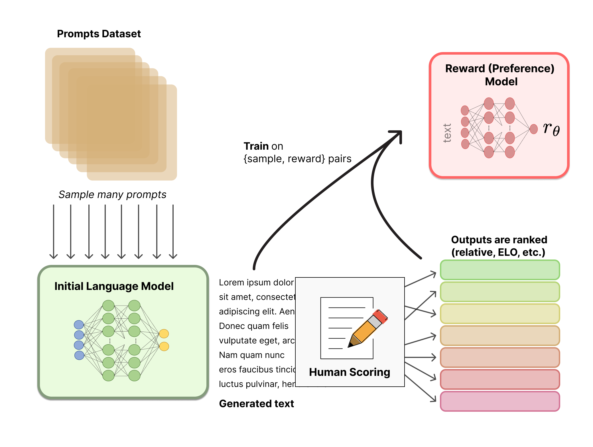

## RLHF with RM

[Illustrating Reinforcement Learning from Human Feedback (RLHF) (huggingface.co)](https://huggingface.co/blog/rlhf)

### 奖励模型(Reward Model, RM)

奖励模型 $r_\theta$: 输入是一段文本，返回一个标量奖励值，其在数值上代表人类的喜好。

标注数据的过程一般是**将模型的多个输出进行排序, 而不是直接标注一个标量分数**. 因为不同人的价值观不同, 会导致分数的绝对值没有意义.

一般是对同一个prompt用不同的模型得到两个输出, 比较谁更好.

其实就是训练一个**排序模型**, 因此理论上各种**排序损失, 对比学习损失**都可以用来训练RM.

### 奖励函数

**reward function:** is a combination of the **preference model** and **a constraint on policy shift**.

奖励函数=就是奖励模型+一些对Policy shift的约束.
$$
r = r_\theta - \lambda r_\text{KL}
$$
在奖励模型 $r_\theta$ 的基础上, 额外加入了一个惩罚项 $r_\text{KL}$. 它是被训练的模型(也叫RL Policy)与 reference model 之间 per-token 的概率分布的 KL 散度.

 这个惩罚项防止RL Policy 与 reference model 的差距过大, 这对保证训练后的模型依旧能输出通顺有条理的文本很有帮助. 如果没有这一项, 可能会出现reward hacking(即模型胡言乱语但 reward model 却给高分).

> In practice, the KL divergence is approximated via sampling from both distributions (explained by John Schulman [here](http://joschu.net/blog/kl-approx.html)). 
>
> 在实践中, KL 散度是通过从两个分布中采样来估计的. [详情](http://joschu.net/blog/kl-approx.html)

> Some RLHF systems have added additional terms to the reward function. For example, OpenAI experimented successfully on InstructGPT by mixing in additional pre-training gradients (from the human annotation set) into the update rule for PPO. It is likely as RLHF is further investigated, the formulation of this reward function will continue to evolve.
>
> 有些RLHF系统还会加入一些额外的项, 例如 OpenAI 的 InstructGPT 中, 将**预训练梯度加到了PPO的更新策略中**.

### 优化

最优, 优化就是采用强化学习中的一些强化学习算法, 例如PPO: 

- [强化学习 Proximal Policy Optimization (PPO) - ㅤJJVVㅤ - 博客园 (cnblogs.com)](https://www.cnblogs.com/jjvv/p/17651945.html)
- PPO has been around for a relatively long time – there are [tons](https://spinningup.openai.com/en/latest/algorithms/ppo.html) of [guides](https://huggingface.co/blog/deep-rl-ppo) on how it works.

参考: [李宏毅老师课件](https://speech.ee.ntu.edu.tw/~tlkagk/courses/MLDS_2018/Lecture/PPO%20(v3).pdf)

PPO: Default reinforcement learning algorithm at OpenAI

PPO = Policy Gradient 从 On-policy 到 Off-policy, 再加一些constraint

### PPO

#### Policy Gradient

##### Basic Conception
- Actor: 动作执行者(智能体)
- Env: 环境
- Reward Function: 奖励函数
- Policy $\pi$ : a network with parameter $\theta$.

    Input: 当前的 Env.

    Output: actor 要采取的下一个 action 的分布.
- Trajectory $\tau$: 一系列的 Env 和 Action, $\set{s_1,a_1,s_2,a_2, \dots}$
    
    在参数为 $\theta$ 情况下, 发生$\tau$的概率: $p_{\theta}(\tau)=p(s_1)p_{\theta}(a_1|s_1)p(s_2|s_1,a_1)p_{\theta}(a_2|s_2)\cdots$
##### Optimization
###### Object

给定 $\tau$, 可以计算 $\tau$ 的 reward, ${R(\tau)}$. 

对于参数为 $\theta$ 的 Policy下,  Trajectory $\tau$ 是采样得到的, 因此实际上需要计算的是 reward 的期望值$\overline{R_\theta}$. 我们希望 $\overline{R_\theta}$ 越大越好.
###### Policy Gradient
Reward 的期望:
$$
\begin{equation}
    \begin{aligned}
        \overline{R_\theta}=\sum_\tau R(\tau)p_\theta(\tau)
    \end{aligned}
\end{equation}
$$
求 $\theta$ 的梯度:
$$
\begin{equation}
    \begin{aligned}
        \nabla \overline R_\theta &= \sum_\tau R(\tau)\nabla p_\theta(\tau) \\
        &=\sum_\tau R(\tau) p_\theta(\tau) \frac{\nabla p_\theta(\tau)}{p_\theta(\tau)}\quad &&\text{分子分母同乘} p_\theta(\tau)\\
        &=\sum_\tau R(\tau) p_\theta(\tau) {\nabla \log p_\theta(\tau)}\\
        &=E_{\tau\sim p_\theta(\tau)}[R(\tau)\nabla \log p_\theta(\tau)]\\
        &\approx \frac 1 N \sum_{n=1}^{N} R(\tau^n)\nabla \log p_\theta(\tau^n)\\
        &= \frac 1 N \sum_{n=1}^{N} \sum_{t=1}^{T_n} R(\tau^n)\nabla \log p_\theta(a^n_t|s^n_t)
    \end{aligned}
\end{equation}
$$
由 $\nabla \log p_\theta(\tau)=\frac{\nabla p_\theta(\tau)}{p_\theta(\tau)}$, 可得到第三行公式.
此处可延伸出一个公式:
$$
\begin{equation}
\nabla f(x) = f(x) \nabla \log f(x)
\end{equation}
$$

由$\sum_\tau p_\theta(\tau)f(\tau)=E_{\tau\sim p_\theta(\tau)}[f(\tau)]$, 可得第四行

通过采样的方式估计期望值, 采样 $N$ 个 Trajectory, 既第五行公式

最后将 $p_\theta(\tau)$ 展开代入, 得第六行公式

###### Implementation
最大化 Reward 的期望  $\overline{R_\theta}$, 由公式(2)中梯度的计算, 可以反推出目标函数在实现时定义如下:
$$
\begin{equation}
    \begin{aligned}
        J(\theta) = \frac 1 N \sum_{n=1}^{N} \sum_{t=1}^{T_n} R(\tau^n) \log p_\theta(a^n_t|s^n_t)
    \end{aligned}
\end{equation}
$$
最大化 $object$ 等价于最小化 $loss$:
$$
\begin{equation}
    \begin{aligned}
        loss = -\frac 1 N \sum_{n=1}^{N} \sum_{t=1}^{T_n} R(\tau^n) \log p_\theta(a^n_t|s^n_t)
    \end{aligned}
\end{equation}
$$
其中, $a^n_t, s^n_t$ 是在参数为 $\theta$ 的 policy 下采样得到的.

与交叉熵损失对比: 其实就是将采样得到的 $a^n_t$ 视作grand truth计算交叉熵, 区别在于针对不同的 Trajectory $\tau^n$, 要多乘了一个 $R(\tau^n)$

> 对于RLHF来说, 就是：
> 1. 对于某个指令 $I$, 采样多条输出 $O=\set{o_1, o_2, \cdots, o_n}$(即多个Trajectory, 其中每个 $o_i$ 表示一个Trajectory) 或者用多个指令，每个指令采样一个输出，不重要，不影响后续操作。 
> 2.把这些 $O$ 作为label, 用teacher forcing的方式计算交叉熵损失, 不过在对于每个样本 $o_i$, 其损失最终要额外乘一个奖励值$R(o_i)$

##### Tips
###### Add a baseline

$R(\tau^n)$ 可能总为正数, 这样在 training时, 相当于告诉 model, 不论时什么action 都要将它的概率提升.

理想情况下, 这样是没有问题的, 因为 Reward 即使总是正的, 也有大有小. 

当时实际上, action 是采样得到的, 这会导致如果有的 action 没有被采样到, 它的概率相对于被采样到的 action 就会下降, 而这时, 并不能表示当前环境下采取这个 action 不好. **改进1: reward要减去一个 baseline, $b$.**

直观上的解释是, 如果一个 $\tau$ 中的 action 导致reward 增加的不够多, 我们也认为这个 action 不够好. 改进后的目标函数如下:
$$
\begin{equation}
    \begin{aligned}
        J(\theta) = \frac 1 N \sum_{n=1}^{N} \sum_{t=1}^{T_n} (R(\tau^n)-b) \log p_\theta(a^n_t|s^n_t)
    \end{aligned}
\end{equation}
$$

###### Assign Suitable Credit

再来看一下目标函数:
$$
\begin{equation}
    \begin{aligned}
        J(\theta) = \frac 1 N \sum_{n=1}^{N} \sum_{t=1}^{T_n} (R(\tau^n)-b) \log p_\theta(a^n_t|s^n_t)
    \end{aligned}
\end{equation}
$$
对于同一个 Trajectory $\tau$ 中, 针对每个状态 $s$ 下, 执行动作 $a$, 都有相同的 Reward 系数. 这是不合理的.
例如图的左边, 在 $s_b$ 执行 $a_2$ 不是一个好的选择, 他会导致接下来进入 $s_c$, 并执行 $a_3$, 得到 -2 分.
由此, 提出改**改进2: 每个时刻的 reward 改为, 当前时刻到结束时刻的 reward 的总和.**

某时刻的 action, 经过越长时间, 它的影响力就越小. 也就是与该 action 间隔很久的 reward 与该 action 的关系很小. 由此提出**改进3: 再乘一个衰减系数 $\gamma^{t'-t}$.**

最后, 将整个系数项称为 Advantage Function, $A^\theta(s_t, a_t)$.其含义为, 在某 state 下, $a_t$ 相较于其他的 action, 有多好. (这个 $A$, 通常可以是用一个网络来预测，一般称作critic)

> 对于RLHF来说，可以参考这篇[文章](https://zhuanlan.zhihu.com/p/645225982)。
>
> RLHF中， 对于每个token来说，其 reward 包括 reward model 对整个序列的打分以及一个与 ref model 之间的KL散度，KL这一项的计算方式就如改进2所示，累计当前到最后一个 token 的KL的和。最终这个值就叫做该 token 的**实际收益**。
>
> critic model 可以计算 token 的**期望收益**。（critic model 是一个与与policy差不多的模型，可以与policy共享参数也可以不）
>
> 最终， 某个 token 的 **Advantage Fuction** 就是 **实际收益-期望收益**。

最终得目标函数与梯度的公式如下:
$$
\begin{equation}
    \begin{aligned}
        J(\theta) &= \frac 1 N \sum_{n=1}^{N} \sum_{t=1}^{T_n} A^\theta(s_t, a_t) \log p_\theta(a^n_t|s^n_t)\\
        \nabla J(\theta) &= \frac 1 N \sum_{n=1}^{N} \sum_{t=1}^{T_n} A^\theta(s_t, a_t) \nabla\log p_\theta(a^n_t|s^n_t)
    \end{aligned}
\end{equation}
$$
**公式中的 $A^\theta(s_t, a_t)$ 不是指 $A$ 中含有参数 $\theta$, 只是代表从 $(s_t, a_t)$ 是从 $\theta$ 中采样来的.*

#### On-policy $\rightarrow$ Off-policy
##### On-policy
梯度计算公式:
$$
\begin{equation}
    \nabla \overline R_\theta =E_{\tau\sim p_\theta(\tau)}[R(\tau)\nabla \log p_\theta(\tau)]\\
\end{equation}
$$
目前为止的做法其实是一种 on-policy 的方法: 
- 每次更新梯度前, 都需要从 $\pi_\theta$ 中采样 $\tau$.
- 参数更新后, 又需要用更新后的参数重新采样 $\tau$.

目标是: 从另一个 policy, $\pi_{\theta'}$ 中采样数据, 用来训练 $\pi_\theta$. 这样就可以重复利用这些采样得到的数据.

##### Importance Sampling(重要性采样)
$x$ 服从 $p$ 分布时, 计算 $f(x)$ 期望 $E_{x\sim p}[f(x)]$ 的做法: 一般是从 $p$ 中采样一些 $x$, 带入 $f(x)$ 求平均, 用这个值来估计所求期望. 

现在, 假设无法从 $p$ 中直接采样 $x$, 但可以从另一个分布 $q$ 中采样 $x$. 可以对 $E_{x\sim p}[f(x)]$ 做如下变形: 
$$
\begin{equation}
    \begin{aligned}
        E_{x\sim p}[f(x)] &= \int f(x)p(x) \, dx\\
        &=\int f(x)\frac{p(x)}{q(x)}q(x) \, dx\\
        &= E_{x\sim q}[f(x)\frac{p(x)}{q(x)}]
    \end{aligned}
\end{equation}
$$
这样, 我们就可以用 $q$ 中采样的数据来估计期望值 $E_{x\sim p}[f(x)]$. 这就是 Importance Sampling.

**Issue of Importance Sampling**
理论上, 我们已经得出两个期望值是相等的:
$$
\begin{equation}
    E_{x\sim p}[f(x)] = E_{x\sim q}[f(x)\frac{p(x)}{q(x)}].
\end{equation}
$$
那么它们的方差是否相等呢? $Var_{x\sim p}[f(x)] == Var_{x\sim q}[f(x)\frac{p(x)}{q(x)}] ?$

由公式
$$
\begin{equation}
Var[x] = E[x^2]-(E[x])^2
\end{equation}
$$
可以得出:
$$
\begin{equation}
    \begin{aligned}
        Var_{x\sim p}[f(x)]&=E_{x\sim p}[f^2(x)]-(E_{x\sim p}[f(x)])^2\\
        Var_{x\sim q}[f(x)\frac{p(x)}{q(x)}] &=E_{x\sim q}[(f(x)\frac{p(x)}{q(x)})^2]-(E_{x\sim q}[f(x)\frac{p(x)}{q(x)}])^2\\
        &=\int (f(x)\frac{p(x)}{q(x)})^2q(x) \, dx - (E_{x\sim p}[f(x)])^2\\
        &=\int f^2(x)\frac{p(x)}{q(x)}p(x) \, dx - (E_{x\sim p}[f(x)])^2\\
        &=E_{x\sim p}[f^2(x)\frac{p(x)}{q(x)}]-(E_{x\sim p}[f(x)])^2
    \end{aligned}
\end{equation}
$$
对比发现, 第一项中后者比前者多乘了一个 $\frac{p(x)}{q(x)}$, 也就是说当 $p$ 与 $q$ 相差很多时, 它们的方差也会差很多. 

这样就会出现一问题: 理论上, 无论 $p,q$ 的分布是什么样的, 当我们从 $p$ 和 $q$ 采样足够多次时, 是可以得到 $E_{x\sim p}[f(x)] = E_{x\sim q}[f(x)\frac{p(x)}{q(x)}]$ 的.
但是当 $p,q$ 差距过大, 而我们采样的次数又不够多时, 因为它们之间的方差差距很大, 所以最后很可能导致期望差距很大.

一个直观的例子:

图中 $p,q$两个分布的差异很大.

当我们采样次数不够多, 导致没有采样到最左边那个样本时, 就会出现实际上 $E_{x\sim p}[f(x)]$ 应是一个负值, 但我们用 $E_{x\sim q}[f(x)\frac{p(x)}{q(x)}]$ 计算出来的却是一个正值. 

而当我们采样到最左边那个样本时, 因为此时 $\frac{p(x)}{q(x)}$ 的值将会非常大, 所以可以把 $E_{x\sim q}[f(x)\frac{p(x)}{q(x)}]$ 拉回负值.

##### Off-policy
将 Importance Sampling 用在 policy gradient 中, 我们就可以得到:
$$
\begin{equation}
    \begin{aligned}
        \nabla \overline R_\theta &=E_{\tau\sim p_\theta(\tau)}[R(\tau)\nabla \log p_\theta(\tau)]\\
        &=E_{\tau\sim p_{\theta'}(\tau)}[\frac{p_{\theta}(\tau)}{p_{\theta'}(\tau)}R(\tau)\nabla \log p_\theta(\tau)]
    \end{aligned}
\end{equation}
$$
这样, 我们就可以从 $\theta'$ 中采样数据, 然后多次利用这些数据来更新 $\theta$.

结合之前添加[Tips](#tips)后得到的公式(8), 有:
$$
\begin{equation}
    \begin{aligned}
        \nabla \overline R_\theta 
        &=E_{(s_t,a_t)\sim\pi_{\theta}}[A^{\theta}(s_t, a_t) \nabla\log p_\theta(a^n_t|s^n_t)]\\
        &=E_{(s_t,a_t)\sim\pi_{\theta'}}[\frac{p_\theta(s_t, a_t)}{p_{\theta'}(s_t, a_t)}A^{\theta'}(s_t, a_t) \nabla\log p_\theta(a^n_t|s^n_t)]\\
        &=E_{(s_t,a_t)\sim\pi_{\theta'}}[\frac{p_\theta(a_t|s_t)p_\theta(s_t)}{p_{\theta'}(a_t|s_t)p_{\theta'}(s_t)}A^{\theta'}(s_t, a_t) \nabla\log p_\theta(a^n_t|s^n_t)]\\
        &=E_{(s_t,a_t)\sim\pi_{\theta'}}[\frac{p_\theta(a_t|s_t)}{p_{\theta'}(a_t|s_t)}A^{\theta'}(s_t, a_t) \nabla\log p_\theta(a^n_t|s^n_t)]\quad &&\text{假设}p_\theta(s_t)=p_{\theta'}(s_t)\\
    \end{aligned}
\end{equation}
$$
**为什么假设$p_\theta(s_t)=p_{\theta'}(s_t)$, 因为难以计算 ?*

再由公式(3)得:
$$
\begin{equation}
    \nabla \overline R_\theta=E_{(s_t,a_t)\sim\pi_{\theta'}}[\frac{\nabla p_\theta(a_t|s_t)}{p_{\theta'}(a_t|s_t)}A^{\theta'}(s_t, a_t)]
\end{equation}
$$
反推目标函数:
$$
\begin{equation}
    J^{\theta'}(\theta)=E_{(s_t,a_t)\sim\pi_{\theta'}}[\frac{p_\theta(a_t|s_t)}{p_{\theta'}(a_t|s_t)}A^{\theta'}(s_t, a_t)]
\end{equation}
$$

#### Add constraint
目前为止, 我们利用 Importance Sampling 完成了 Policy Gradient 从 On-policy 到 Off-policy 的优化. 

但是 Importance Sampling 在实际应用中有一个不得不考虑的限制, 就是我们无法保证能采样足够多的数据, 这时当两个分布 $p_\theta, p_{\theta'}$差异过大时, 难以保证期望相等.

PPO做的事情, 简单说就是, 限制两个分布 $p_\theta, p_{\theta'}$ 不能差太多.
$$
\begin{equation}
    J_{PPO}^{\theta'}(\theta)=J^{\theta'}(\theta)-\beta KL(\theta, \theta')
\end{equation}
$$
**注: 此处 KL 散度指的不是将两个模型的参数看作分布,拉近两个模型的参数的距离. 而是两个模型行为上的距离, 就是当两个模型输入同样的 state 时, 希望输出的 action 的分布尽可能像**

#### Conclusion
##### PPO algorithm

##### PPO2
PPO2: 简化 PPO 的计算.

首先, 我们将横坐标 $x$ 设为 $\frac{p_\theta(a_t|s_t)}{p_{\theta^k}(a_t|s_t)}$, 则函数 $y=x$ 与 $y=clip(x, 1-\epsilon, 1+\epsilon)$ 的图像分别为图中的绿线和蓝线.
其中, $clip(x, a, b)=\left\{\begin{aligned}a,\quad &x\le a\\ x, \quad &a<x<b\\ b, \quad &x \ge b\end{aligned}\right.$

- 当 $A>0$ 时, $J_{PPO2}^{\theta^k}(\theta)$ 就是左图中红线, 我们要最大化目标函数, 也就希望 $x$ 越大越好, 但是当超过 $1+\epsilon$ 后, 对目标函数就没有 benefit 了. 这样就阻止了进一步优化.
- 当 $A<0$ 时, 同理, 如右图.

**目的依旧是保证两个分布 $p_\theta, p_{\theta^k}$ 差距不能过大.**

##### Experiment

## RLHF without RM

### DPO算法

[arxiv.org/pdf/2305.18290](https://arxiv.org/pdf/2305.18290)

[What is the Plackett-Luce model? | Statistical Odds & Ends (wordpress.com)](https://statisticaloddsandends.wordpress.com/2024/04/24/what-is-the-plackett-luce-model/)

**奖励模型**

> 有多种方式可以建模偏好: 
>
> - Bradley-Terry (BT) Model, 对于输入 $x$, 得到两个输出 $y_1, y_2$, 定义偏好分布为:
>
>   
>
> - Plackett-Luce Model, 对于输入 $x$, 得到多个输出 $\set{y_1, y_2, \dots, y_k}$, 定义偏好分布为:
>
>   
>
> 其中 $r^*$表示 Reward model.

以BT Model 为例, 奖励模型是损失定义如下: 

其实就是二元交叉熵损失.

**最优化**

最优化目标就是**最大化模型的期望得分**, 其中KL散度的作用不在赘述, 见[奖励函数](##奖励函数)部分.

> The standard approach [49, 38, 1, 26] has been to construct the reward function: 
>
> 一些标准的方法也用如下的方式构造奖励函数: 
>
> 

**最优解**

当**奖励模型**确认后, 带有**KL约束**的最优化目标的**最优解**也就随之确定. 换句话说, 当**ref模型**和**奖励模型**被确定后, **最优目标模型**也就确定了. 可以用以下公式表示: 

其中, 

**ref模型, 奖励模型, 最优目标模型一一对应**

将上式进行变化(两边同时取对数)后, 可得到: 

将其代入用BT建模的偏好模型, 就有: 

这样, 我们就可以用偏好数据直接优化 policy model, 优化目标与奖励模型的优化类似: 

**一句话就是我们将reward model用policy model表示了出来, 那么用偏好数据对reward model进行优化就是直接优化policy model.**

## 关于偏好数据来源

### 对于有RM的RLHF

偏好数据用于训练 reward model， 如果偏好数据不是采样于 policy model 或这 reference model，可能增加 reward hacking 的风险。因为RM学会的是如何评判某未知模型的输出，用他评判当前模型可能会有问题。

~~理论上, 对于Policy gradient算法而言, 数据是从reference model 采样得到的, 并且每次Policy (即被更新的模型) 梯度更新后都需要重新采样 (因为对于更新后的Policy, 此时reference model也就变为了更新后的policy).~~

~~但是PPO理论上, 想要解决本质问题的也正是这个, 即能否从另一个 model 采样数据 (Trajectory), 用于当前 Policy 的更新, 这样就可以不用每次更新后都重新采样数据了. PPO中所谓的另一个model, 也就是最初是policy, 将这个作为reference model, 并且不再改变. 然后就可以重复用这一个reference model采样数据用于训练. 但是有一个限制, 就是被训练的 model 不能与 reference model 差太多, 也就是PPO算法中的KL散度项.~~

~~综上, 如果使用PPO算法，偏好数据来源于一个未知的模型也未尝不可。~~

### 对于没有RM的RLHF

对于DPO来说，DPO的推导依赖于一个关于 RL 优化目标的推到，即经过 RL 后，最终得到的最优模型 $\pi_r$ 理论上可以用 reference model 和 奖励模型表示: 

其中, 

理论上，DPO的偏好数据来源好像也不重要，偏好数据决定了 reward model，然后 reward model 与 $\pi_r$ 和 $\pi_\text{ref}$ 一一对应。论文作者虽然使用了现成的偏好数据，但他推荐使用采样自 reference model 的偏好数据。

~~理论上, DPO的数据需要来源于对 reference model 的采样. 但论文中并没有这样作, 而是直接用了来源于其他 policy 的偏好数据.~~

### 其他说法

[RSO 2024 ICLR](https://arxiv.org/pdf/2309.06657)

Google deepmind 这篇论文对DPO进行了进一步的讨论。DPO中，最后用TB模型对 reward model 进行建模：

是经典的排序算法。（论文中也讨论了TB模型的外推，即多项排序。）

而Google这篇论文，进一步从两方面讨论了对reward model建模：

**1. Choice of loss function**

其结合了SLiC的思想，使用了Hinge loss。

**2. Choice of preference data distribution**

讨论了偏好数据的来源，表示偏好数据最好来源于**最优policy $\pi^*$**。但$\pi^*$无法获得, 也就无法从 $\pi^*$ 中采样数据，因此论文中又通过 reward model 以及DPO中的推导公式：

来估计$\pi^*$。

## RLHF with RM or Not 的影响

[Alignment近期发展思考 - 知乎 (zhihu.com)](https://zhuanlan.zhihu.com/p/673182106)

DPO在实际场景下更容易overfitting，而PPO算法更robust一些

因为在BT model下preference function可以写成如下的形式，其中 $\sigma(\cdot)$ 是sigmoid函数。
$$
p\left(y \succ y^{\prime} \mid x\right)=\sigma\left(r(x, y)-r\left(x, y^{\prime}\right)\right)
$$
细看这样的perference函数下，意味着”preference”并不是 $r(x, y)$ 比  $r(x, y^{\prime})$ 高，人就一定会偏好 $y$，而是依概率采样的过程。所谓“萝卜白菜，各有所好“，在语言模型下maximize的其实是“大众的偏好分布”。

而在实际中，当我们的preference data有限的时候，也许实际 $p\left(y \succ y^{\prime} \mid x\right)=0.8$ <i>，</i>但是在数据集中我们只有很少的样本点，从而估计出来 $p\left(y \succ y^{\prime} \mid x\right)=1$。这样以来在DPO的优化下，根据Bradley-Terry model，会朝着 $\left(r(y)-r\left(y^{\prime}\right)\right) \rightarrow+\infty$ 的方向优化，而最优的policy为 $\pi^*\left(y^{\prime}\mid x\right)=0$ 。这个结果显然存在overfitting，和我们预期不符。

那为什么RLHF的算法为什么不会存在这个问题呢？是因为RLHF里面的reward model是在 “有限preference data” 下对preference distribution underfit的产物，虽然看上去和DPO的区别仅仅之后显式和隐式的差异，但实际上这个reward function的underfitting在整体的优化中起到比较关键的作用。

> **优化DPO**
>
> 针对上面DPO的问题, [ICLR 2024 的一篇论文]([2309.06657 (arxiv.org)](https://arxiv.org/pdf/2309.06657)) 提出了一种对DPO的优化:
>
> 思想大致就是: 训练一个reward model，用这个reward model生成的reward的差距来量化 $y_w$ 和 $y_l$ 之间的差距大小作为DPO优化performance model loss时的label. 以这种方式把underfit的reward model加进DPO中.
