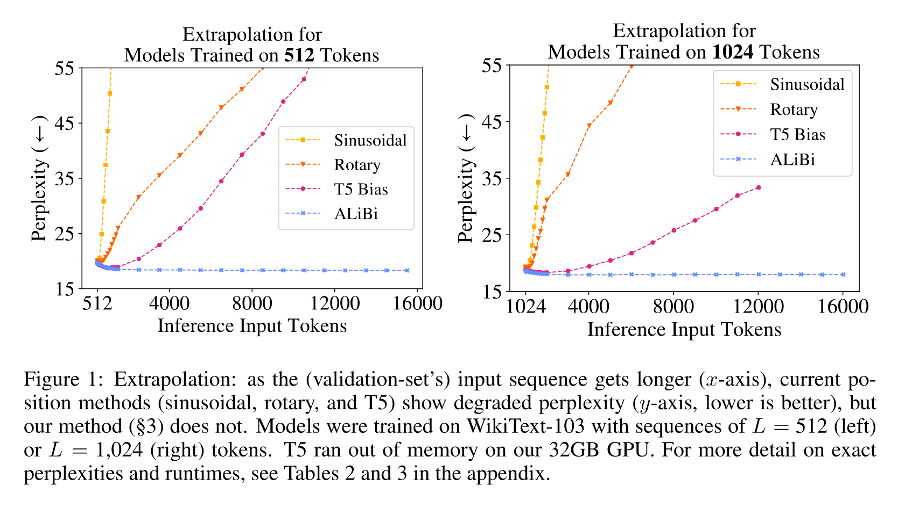

[大模型位置编码 - 飞书云文档 (feishu.cn)](https://wvsao11ddnh.feishu.cn/docx/WwM1dZMnHomyoax8sz5ciaPQnQf)

## Sinusoidal Position Embedding

$$
q_i = (x_i + p_i)W_Q \\ k_j = (x_j + p_j)W_K \\ v_j = (x_j + p_j)W_V \\ a_{i,j} = softmax(\frac{q_ik_j^{\top}}{\sqrt{d_k}} )
$$

**编码函数：**

$$t$$表示当前token在句子序列中的位置，$$d$$表示特征向量维度数为$d$、$i$表示第$$i$$对
$$
\begin{aligned}
PE_{(t,2i)}=\sin(\frac{t}{10000^{2i/d}}),\\
PE_{(t,2i+1)}=\cos(\frac{t}{10000^{2i/d}}) \end{aligned}
$$
**不同的维度(两两一对), 对应的一对频率(周期)不同正余弦函数的. 维度越高, 频率越低, 周期越长**

**不同位置, 相当于正余弦函数值随位置 $t$ 变化而变化**

**函数特性推理：**

对于位置编码的第j组向量$$PE_{(t, j)}$$与$$PE_{(t+k, j)}$$存在如下线性关系

只在word embedding 上添加了一次位置信息

**一些小思考**

- 为什么要分组？
  -  不分组然后向量整体旋转行不行？理论上也可以，但是这样做的话上面的矩阵就变成了一个稠密矩阵，影响运算速度。
- 为什么随着维度下标 $i$ 的增加，旋转的角度越来越小？
  -  感觉跟时钟系统有点像吧，时针分针秒针分别表示不同粒度的时间，在钟表上顺时针旋转。这里既然也是旋转，那用不同的颗粒度应该能捕获更细粒度的位置信息。

**参考：**

https://mp.weixin.qq.com/s/lYXNXvQHWtm7faVJvUKOew

## RoPE

[再论大模型位置编码及其外推性（万字长文） - 知乎 (zhihu.com)](https://zhuanlan.zhihu.com/p/675243992)

[苏剑林. (Mar. 23, 2021). 《Transformer升级之路：2、博采众长的旋转式位置编码 》[Blog post]](https://spaces.ac.cn/archives/8265)

**基本思路**

“通过绝对位置编码的方式实现相对位置编码”

为了达到这个目的，我们假设通过下述运算来给$q,k$添加绝对位置信息：
$$
\begin{aligned}
\tilde{\boldsymbol{q}}_m=\boldsymbol{f}(\boldsymbol{q},m),\quad\tilde{\boldsymbol{k}}_n=\boldsymbol{f}(\boldsymbol{k},n)\\
\langle\boldsymbol{f}(\boldsymbol{q},m),\boldsymbol{f}(\boldsymbol{k},n)\rangle=g(\boldsymbol{q},\boldsymbol{k},m-n)
\end{aligned}
$$

Attention的核心运算是内积，所以我们希望的内积的结果带有相对位置信息，因此假设存在恒等关系(3)

**求解过程 略**

**编码形式：**

求解结果如下（公式3中示例q为一个2维向量）
$$
\begin{equation} \boldsymbol{f}(\boldsymbol{q},m) = \begin{pmatrix}\cos m\theta&-\sin m\theta\\\sin m\theta&\cos m\theta\end{pmatrix}\begin{pmatrix}q_0\\q_1\end{pmatrix} = \mathcal{R_m} * \boldsymbol{q} \end{equation}
$$

那么扩展到任意维度（为了扩展公式3，两两一对，维度需要是偶数）：
$$
\begin{equation} \underbrace{    \begin{pmatrix} \cos m\theta_0&-\sin m\theta_0&0&0&\cdots&0&0\\\sin m\theta_0&\cos m\theta_0&0&0&\cdots&0&0\\0&0&\cos m\theta_1&-\sin m\theta_1&\cdots&0&0\\0&0&\sin m\theta_1&\cos m\theta_1&\cdots&0&0\\\vdots&\vdots&\vdots&\vdots&\ddots&\vdots&\vdots\\0&0&0&0&\cdots&\cos m\theta_{d/2-1}&-\sin m\theta_{d/2-1}\\0&0&0&0&\cdots&\sin m\theta_{d/2-1}&\cos m\theta_{d/2-1} \end{pmatrix} }_{\mathbf{R}_m} \begin{pmatrix}q_0\\q_1\\q_2\\q_3\\\vdots\\q_{d-2}\\q_{d-1} \end{pmatrix} \end{equation}
$$

也就是说，给位置为$$m$$的向量$$q$$乘上矩阵$$R_m$$、位置为$$n$$的向量$$k$$乘上矩阵$$R_n$$，用变换后的$$Q,K$$序列做Attention，那么Attention就自动包含相对位置信息了，因为成立恒等式：
$$
\begin{equation}    (\mathcal{R}_mq)^\top(\mathcal{R}_nk)=q^\top\mathcal{R}_m^\top\mathcal{R}_nk=q^\top\mathcal{R}_{n-m}k \end{equation}
$$
可以看到，**RoPE形式上和Sinusoidal位置编码有点相似，只不过Sinusoidal位置编码是加性的，而RoPE可以视为乘性的**。在$$\theta_i$$的选择上，我们同样沿用了**Sinusoidal位置编码**的方案，即$$\theta_i =10000^{−2i/d}$$，它可以带来一定的**远程衰减性**。随着相对距离的变大，内积结果有衰减趋势的出现。

**优点: 相比于绝对位置编码通过加的方式融入输入x中, RoPE对于相对位置信息的表示更显式, 因为融入RoPE位置信息的qk的点成可以写作原始q,k,和n-m的一个函数.  此外, RoPE在每一层都加, 而绝对位置编码只在输入时加.**

## Abili

**Attention with Linear Biases (ALiBi)**

代表模型： BLOOM、baichuan2-13b、MOSS

**核心思想：**

不给词向量加入位置嵌入向量，而是用一个和query, key之间的距离成比例的一个“惩罚项”来偏置query-key的注意力得分。

本文的做法是不添加position embedding，然后添加一个静态的不学习的bias：

$$
\begin{equation}    
\text{attention\_score}=\text{softmax}(q_iK^T+m\cdot[-i,\ldots,-2,-1,0, -\inf, \cdots]) 
\end{equation}
$$
在query和key做矩阵点乘的基础上，加上一个常数负值，比如距离当前位置前1位为-1， 前两位为-2，这些常数要乘上 m，论文叫做坡度，对于n头的注意力模型，m的取值序列从$$2^{\frac{-8}{n}*1}, 2^{\frac{-8}{n}*2} ... 2^{-8}$$。

例如，对于8头注意力模型:

m使用序列:$$2^{−1},2^{−2},...,2^{−8}$$

对于16头注意力模型:

m使用序列:$$2^{−0.5},2^{−1},...,2^{−8}$$

- 对**不同的head**使用**不同的坡度**是为了让不同的head有个不同的**感受粒度(人话就是， 使不同的头能关注的范围有所不同。m越小，能关注的范围越大，也就是能关注更前面的context)**
- 论文认为**坡度**的最好范围是**（0，1）**，坡度的选择比较**鲁棒**，即使随机采样也能取得较好性能。
- ALiBi的注意力权重没有通过$$d_k$$缩放

**优点：**

1. 直接外推性，在短样本上训练，直接在长样本上推理，困惑度相比正弦位置编码几乎不增

1. 显存更少，几乎不产生额外显存（相比很少可忽略），运算更快。

**参考：**

https://zhuanlan.zhihu.com/p/657161287

Train Short, Test Long: Attention with Linear Biases Enables Input Length Extrapolation http://arxiv.org/abs/2108.12409

## 带有旋转角度的位置编码可以自然的外推

可见文档：[大模型上下文外推方法](https://wvsao11ddnh.feishu.cn/docx/NYqyd94iCouL9bx3I3sc4Ljdn7d)

https://spaces.ac.cn/archives/9948

**反向外推（没有严谨的实验证明）**

推理时，调整缩放系数到 插值后的推理位置区间和base训练时数据保持一致，基本可以达到最好的性能。

模型窗口4k，训练3k。

推理8k，调整缩放因子，使8k的位置编码数值范围全部在3k之内，性能最好。