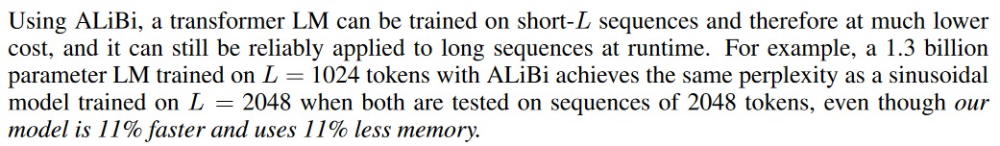

## 常见位置编码

### Sinusoidal Position Embedding

[大模型位置编码 - 飞书云文档 (feishu.cn)](https://wvsao11ddnh.feishu.cn/docx/WwM1dZMnHomyoax8sz5ciaPQnQf)
$$
q_i = (x_i + p_i)W_Q \\ k_j = (x_j + p_j)W_K \\ v_j = (x_j + p_j)W_V \\ a_{i,j} = softmax(\frac{q_ik_j^{\top}}{\sqrt{d_k}} )
$$

**编码函数：**

$t$表示当前token在句子序列中的位置，$d$表示特征向量维度数为$d$、$i$表示第$i$对
$$
\begin{aligned}
PE_{(t,2i)}=\sin(\frac{t}{10000^{2i/d}}),\\
PE_{(t,2i+1)}=\cos(\frac{t}{10000^{2i/d}}) \end{aligned}
$$
**不同的维度(两两一对), 对应的一对频率(周期)不同正余弦函数的. 维度越高, 频率越低, 周期越长**

**不同位置, 相当于正余弦函数值随位置 $t$ 变化而变化**

**函数特性推理：**

对于位置编码的第j组向量 $PE_{(t, j)}$ 与 $PE_{(t+k, j)}$ 存在如下线性关系

只在word embedding 上添加了一次位置信息

**一些小思考**

- 为什么要分组？
  -  不分组然后向量整体旋转行不行？理论上也可以，但是这样做的话上面的矩阵就变成了一个稠密矩阵，影响运算速度。
- 为什么随着维度下标 $i$ 的增加，旋转的角度越来越小？
  -  感觉跟时钟系统有点像吧，时针分针秒针分别表示不同粒度的时间，在钟表上顺时针旋转。这里既然也是旋转，那用不同的颗粒度应该能捕获更细粒度的位置信息。

**参考：**

https://mp.weixin.qq.com/s/lYXNXvQHWtm7faVJvUKOew

### RoPE

[再论大模型位置编码及其外推性（万字长文） - 知乎 (zhihu.com)](https://zhuanlan.zhihu.com/p/675243992)

[苏剑林. (Mar. 23, 2021). 《Transformer升级之路：2、博采众长的旋转式位置编码 》[Blog post]](https://spaces.ac.cn/archives/8265)

**基本思路**

“通过绝对位置编码的方式实现相对位置编码”

为了达到这个目的，我们假设通过下述运算来给$q,k$添加绝对位置信息：
$$
\begin{aligned}
\tilde{\boldsymbol{q}}_m=\boldsymbol{f}(\boldsymbol{q},m),\quad\tilde{\boldsymbol{k}}_n=\boldsymbol{f}(\boldsymbol{k},n)\\
\langle\boldsymbol{f}(\boldsymbol{q},m),\boldsymbol{f}(\boldsymbol{k},n)\rangle=g(\boldsymbol{q},\boldsymbol{k},m-n)
\end{aligned}
$$

Attention的核心运算是内积，所以我们希望的内积的结果带有相对位置信息，因此假设存在恒等关系(3)

**求解过程 略**

**编码形式：**

求解结果如下（公式3中示例q为一个2维向量）
$$
\begin{equation} \boldsymbol{f}(\boldsymbol{q},m) = \begin{pmatrix}\cos m\theta&-\sin m\theta\\\sin m\theta&\cos m\theta\end{pmatrix}\begin{pmatrix}q_0\\q_1\end{pmatrix} = \mathcal{R_m} * \boldsymbol{q} \end{equation}
$$

那么扩展到任意维度（为了扩展公式3，两两一对，维度需要是偶数）：
$$
\begin{equation} \underbrace{    \begin{pmatrix} \cos m\theta_0&-\sin m\theta_0&0&0&\cdots&0&0\\\sin m\theta_0&\cos m\theta_0&0&0&\cdots&0&0\\0&0&\cos m\theta_1&-\sin m\theta_1&\cdots&0&0\\0&0&\sin m\theta_1&\cos m\theta_1&\cdots&0&0\\\vdots&\vdots&\vdots&\vdots&\ddots&\vdots&\vdots\\0&0&0&0&\cdots&\cos m\theta_{d/2-1}&-\sin m\theta_{d/2-1}\\0&0&0&0&\cdots&\sin m\theta_{d/2-1}&\cos m\theta_{d/2-1} \end{pmatrix} }_{\mathbf{R}_m} \begin{pmatrix}q_0\\q_1\\q_2\\q_3\\\vdots\\q_{d-2}\\q_{d-1} \end{pmatrix} \end{equation}
$$

也就是说，给位置为$m$的向量$q$乘上矩阵$R_m$、位置为$n$的向量$k$乘上矩阵$R_n$，用变换后的$Q,K$序列做Attention，那么Attention就自动包含相对位置信息了，因为成立恒等式：
$$
\begin{equation}    (\mathcal{R}_mq)^\top(\mathcal{R}_nk)=q^\top\mathcal{R}_m^\top\mathcal{R}_nk=q^\top\mathcal{R}_{n-m}k \end{equation}
$$
可以看到，**RoPE形式上和Sinusoidal位置编码有点相似，只不过Sinusoidal位置编码是加性的，而RoPE可以视为乘性的**。在$\theta_i$的选择上，我们同样沿用了**Sinusoidal位置编码**的方案，即$\theta_i =10000^{−2i/d}$，它可以带来一定的**远程衰减性**。随着相对距离的变大，内积结果有衰减趋势的出现。

由于$\boldsymbol{\mathcal{R}}_m$的稀疏性，所以直接用矩阵乘法来实现会很浪费算力，推荐通过下述方式来实现RoPE：
$$
\begin{equation}\begin{pmatrix}q_0 \\ q_1 \\ q_2 \\ q_3 \\ \vdots \\ q_{d-2} \\ q_{d-1} 
\end{pmatrix}\otimes\begin{pmatrix}\cos m\theta_0 \\ \cos m\theta_0 \\ \cos m\theta_1 \\ \cos m\theta_1 \\ \vdots \\ \cos m\theta_{d/2-1} \\ \cos m\theta_{d/2-1} 
\end{pmatrix} + \begin{pmatrix}-q_1 \\ q_0 \\ -q_3 \\ q_2 \\ \vdots \\ -q_{d-1} \\ q_{d-2} 
\end{pmatrix}\otimes\begin{pmatrix}\sin m\theta_0 \\ \sin m\theta_0 \\ \sin m\theta_1 \\ \sin m\theta_1 \\ \vdots \\ \sin m\theta_{d/2-1} \\ \sin m\theta_{d/2-1} 
\end{pmatrix}\end{equation}
$$
**优点: 相比于绝对位置编码通过加的方式融入输入x中, RoPE对于相对位置信息的表示更显式, 因为融入RoPE位置信息的qk的点成可以写作原始q,k,和n-m的一个函数.  此外, RoPE在每一层都加, 而绝对位置编码只在输入时加.**

> **三角函数角度看位置向量**
>
> 总的来说, 位置 $m$ 处对应的位置编码向量(矩阵)由 $\cos(m\alpha^{−2i/d})$ 和 $\sin(m\alpha^{−2i/d})$ 组成. 其中 $i$ 是位置编码向量(矩阵)的某个分量. $\alpha$ 一般取 10000. 从三角函数的角度看,  $\theta_i=\alpha^{−2i/d}$就是角频率.
>
> - 竖着看, 看某个位置编码向量的分量, 从高维到低维, 角频率 $\alpha^{−2i/d}$ 从1降到0. 因此低维部分的三角函数的周期短, 频率高, 而高维部分的三角函数周期长, 频率低.
> - 横着看, 看不同位置的位置编码, 随之 $m$ 的增大, 就是在三角函数上打转.

### ALiBi

**Attention with Linear Biases (ALiBi)**

代表模型： BLOOM、baichuan2-13b、MOSS

**核心思想：**

不给词向量加入位置嵌入向量，而是用一个和query, key之间的距离成比例的一个“惩罚项”来偏置query-key的注意力得分。

本文的做法是不添加position embedding，然后添加一个静态的不学习的bias：

$$
\begin{equation}    
\text{attention\_score}=\text{softmax}(q_iK^T+m\cdot[-i,\ldots,-2,-1,0, -\inf, \cdots]) 
\end{equation}
$$
在query和key做矩阵点乘的基础上，加上一个常数负值，比如距离当前位置前1位为-1， 前两位为-2，这些常数要乘上 m，论文叫做坡度，对于n头的注意力模型，m的取值序列从$2^{\frac{-8}{n}*1}, 2^{\frac{-8}{n}*2} ... 2^{-8}$。

例如，对于8头注意力模型:

m使用序列:$2^{−1},2^{−2},...,2^{−8}$

对于16头注意力模型:

m使用序列:$2^{−0.5},2^{−1},...,2^{−8}$

- 对**不同的head**使用**不同的坡度**是为了让不同的head有个不同的**感受粒度(人话就是， 使不同的头能关注的范围有所不同。m越小，能关注的范围越大，也就是能关注更前面的context)**
- 论文认为**坡度**的最好范围是**（0，1）**，坡度的选择比较**鲁棒**，即使随机采样也能取得较好性能。
- ALiBi的注意力权重没有通过$d_k$缩放

**优点：**

1. 直接外推性，在短样本上训练，直接在长样本上推理，困惑度相比正弦位置编码几乎不增

1. 显存更少，几乎不产生额外显存（相比很少可忽略），运算更快。

**参考：**

https://zhuanlan.zhihu.com/p/657161287

Train Short, Test Long: Attention with Linear Biases Enables Input Length Extrapolation http://arxiv.org/abs/2108.12409

## 免训练长度外推

[Transformer升级之路：16、“复盘”长度外推技术 - 科学空间|Scientific Spaces](https://spaces.ac.cn/archives/9948)

免训练长度外推，一句话：Train Short, Test Long。

如何判断一个模型能否用于长序列呢？

1. 型的长序列Loss或者PPL会不会爆炸
2. 输入足够长的Context，让模型去预测答案，然后跟真实答案做对比，算BLEU、ROUGE等，[LongBench](https://papers.cool/arxiv/2308.14508)就是就属于这类榜单。

### 窗口截断

直接按照训练长度进行截断：

但这个方案并不work，连最基本的PPL不爆炸都做不到。

对上述现象分析后，知乎这篇文章[《Perpetual Sampling Technical Report》](https://zhuanlan.zhihu.com/p/619703849)以及[《LM-Infinite: Simple On-the-Fly Length Generalization for Large Language Models》](https://papers.cool/arxiv/2308.16137)和[《Efficient Streaming Language Models with Attention Sinks》](https://papers.cool/arxiv/2309.17453)这两篇论文得出了一致的结论：**开头的几个token很重要（前几个Token的注意力占比还是很重的，所以不能去掉，去掉注意力就全乱了），不能扔掉。**

其中[《Perpetual Sampling Technical Report》](https://zhuanlan.zhihu.com/p/619703849)中用 LLaMA-30B做了实验，发现最后的非编码层，注意力大多数时候都集中在第一个 token（BOS token） 上面，如果把它扔掉了对 QKV 计算结果的影响会非常大。

因此mask矩阵可以改为如下图所示：

窗口阶段的问题是**牺牲了远程依赖的能力**，ALIBI直接外推，当序列长度足够大的时，就等价于截断其实。

> **三角函数角度看位置向量**
>
> 没什么好说的...

### 位置内插

相对位置的OOD，直接表现就是**预测阶段的相对位置超出了训练时的范围**，由于没有被训练过，“越界”部分的行为无法预估。

将预测的长文本的位置编码乘上因子$\frac{L_{train}}{L_{test}}$, 缩放到训练长度范围内, 如下式所示（式中的位置都是相对位置）
$$
\begin{equation}\begin{aligned}&\text{训练阶段}:\,(1,2,\cdots,n-1,n)\\[5pt] 
&\text{预测阶段}:\,(1,2,\cdots,n,\underbrace{n+1,\cdots,4n-1,4n}_{\text{远处越界}})\xrightarrow{\quad\text{内插}\quad} 
\big(\underbrace{\frac{1}{4},\frac{2}{4},\frac{3}{4}}_{\text{局部失真}},\cdots,n-\frac{1}{4},n\big)\end{aligned}\end{equation}
$$
**位置内插并不算长度外推方案，至少不是免训练的长度外推方案**

位置内插之后同样会有PPL爆炸的问题, 因为其虽然**避免了远处的位置越界问题，但这同时压缩了邻近Token的距离，严重扰乱了模型的局部分辨率**

> **三角函数角度看位置向量**
>
> 训练长度为$L_{train}$, 推理长度为$L_{test}$, 则内插因子$\lambda=\frac{L_{train}}{L_{test}}$. 内插后, 位置向量中的分量就变成了$\cos(m\lambda\alpha^{−2i/d})$ 和 $\sin(m\lambda\alpha^{−2i/d})$ . 把 $\lambda\alpha^{−2i/d}$ 视作 角频率$\theta_i$, 对比外推前, 因为 $\lambda<1$, 角频率变小了, 周期变长了, 会扰乱局部分辨率.

### 保近压远

直接外推的问题是远处越界，而位置内插的问题是局部失真， 提出一种方法集两家之所长。

Leaky ReRoPE通过一个非常直接的思路实现了这一点：假设训练长度为 $L_\text{train}$ 它先设定一个窗口大小 $w, w<L_\text{train}$. 将相对位置分为两部分，在窗口内不改变相对位置实现“局部不失真”，在窗口外使用位置内插实现“远处不越界. 再长度为 $L$ 的序列上推理时如下式：
$$
\begin{equation}\begin{pmatrix} 
\color{red}{0} & \\ 
\color{red}{1} & \color{red}{0} & \\ 
\color{red}{2} & \color{red}{1} & \color{red}{0} & \\ 
\color{red}{\ddots} & \color{red}{2} & \color{red}{1} & \color{red}{0} & \\ 
\color{red}{\tiny{w - 1}} & \color{red}{\ddots} & \color{red}{2} & \color{red}{1} & \color{red}{0} & \\ 
\color{green}{w} & \color{red}{\tiny{w - 1}} & \color{red}{\ddots} & \color{red}{2} & \color{red}{1} & \color{red}{0} & \\ 
\color{green}{\tiny{w + \frac{1}{k}}} & \color{green}{w} & \color{red}{\ddots} & \color{red}{\ddots} & \color{red}{2} & \color{red}{1} & \color{red}{0} & \\ 
\color{green}{\tiny{w + \frac{2}{k}}} & \color{green}{\tiny{w + \frac{1}{k}}} & \color{green}{\ddots} & \color{red}{\ddots} & \color{red}{\ddots} & \color{red}{2} & \color{red}{1} & \color{red}{0} & \\ 
\color{green}{\ddots} & \color{green}{\tiny{w + \frac{2}{k}}} & \color{green}{\ddots} & \color{green}{\ddots} & \color{red}{\ddots} & \color{red}{\ddots} & \color{red}{2} & \color{red}{1} & \color{red}{0} & \\ 
\color{green}{\ddots} & \color{green}{\ddots} & \color{green}{\ddots} & \color{green}{\ddots} & \color{green}{\ddots} & \color{red}{\ddots} & \color{red}{\ddots} & \color{red}{\ddots} & \color{red}{\ddots} & \color{red}{\ddots} & \\ 
\color{green}{\ddots} & \color{green}{\ddots} & \color{green}{\ddots} & \color{green}{\tiny{w + \frac{2}{k}}} & \color{green}{\tiny{w + \frac{1}{k}}} & \color{green}{w} & \color{red}{\tiny{w - 1}} & \color{red}{\ddots} & \color{red}{2} & \color{red}{1} & \color{red}{0} & \\ 
\color{green}{\tiny{w + \frac{L-1-w}{k}}} & \color{green}{\ddots} & \color{green}{\ddots} & \color{green}{\ddots} & \color{green}{\tiny{w + \frac{2}{k}}} & \color{green}{\tiny{w + \frac{1}{k}}} & \color{green}{w} & \color{red}{\tiny{w - 1}} & \color{red}{\ddots} & \color{red}{2} & \color{red}{1} & \color{red}{0} & \\ 
\end{pmatrix}\end{equation}
$$
其中 $k$ 是超参数, 取值 $[1, +\infty]$ 之间. $k$越大, 外推长度就越长: 

- $k=1$时, 等价于无外推, 此时只要推理长度 $L>L_\text{train}$ 就会越界. 
- $k=+\infty$时, 就是无限外推(就是极简的ReRoPE), 此时对于任意长的序列都不会越界. 因为所有窗口之外的位置编码都变为 $w$.

Leaky ReRoPE和ReRoPE的表现确实都非常好: 

- 从Loss来看，它们能做到几乎不损失训练长度内的效果，并且实现了长度外推
- 且Context越长，Loss越低，说明它们在外推的同时还确实保证了远程依赖。

> **三角函数角度看位置向量**
>
> 相当于对局部进行内插, 详见内插法中的分析

### NTK-Aware Interpolation

[原文: NTK-Aware Scaled RoPE allows LLaMA models to have extended (8k+) context size without any fine-tuning and minimal perplexity degradation](https://www.reddit.com/r/LocalLLaMA/comments/14lz7j5/ntkaware_scaled_rope_allows_llama_models_to_have/)

[如何理解 RoPE 的 NTK 扩展 - 知乎 (zhihu.com)](https://zhuanlan.zhihu.com/p/648701937)

[Transformer升级之路：16、“复盘”长度外推技术 - 科学空间|Scientific Spaces](https://spaces.ac.cn/archives/9948#一些插曲)

> **三角函数角度看位置向量**
>
> 在实现上, 同样定义内插因子为 $\lambda=\frac{L_{train}}{L_{test}}$,  但不同于内插法, NTK-Aware会根据维度调整$\lambda$, 最终位置向量中的分量定义为$\cos(m\lambda^{\frac{2i}{d-2}}\alpha^{−2i/d})$ 和 $\sin(m\lambda^{\frac{2i}{d-2}}\alpha^{−2i/d})$ .  达到的效果就是
>
> - 当 $i$ 较小时, 对应位置向量的低维部分, $\lambda^{\frac{2i}{d-2}}$的值接近于1 ($i=0$时取得1), 对应的分量也就接近于原始的$\cos(m\alpha^{−2i/d})$ 和 $\sin(m\alpha^{−2i/d})$ . 
> - 当 $i$ 较大时, 对应位置向量的高维部分,  $\lambda^{\frac{2i}{d-2}}$的值接近于$\lambda$ ($i=\frac{d}{2}-1$时取得$\lambda$), 对应的分量也就接近于内插法的 $\cos(m\lambda\alpha^{−2i/d})$ 和 $\sin(m\lambda\alpha^{−2i/d})$ .
>
> 这么做的道理大概和[YaRN](###YaRN)差不多.

### YaRN

[《YaRN: Efficient Context Window Extension of Large Language Models》](https://papers.cool/arxiv/2309.00071)

#### 转圈视角

[苏剑林blog原文](https://spaces.ac.cn/archives/9948#转圈视角)

在笔者的测试中，它的外推效果非常好，只是**略逊于Leaky ReRoPE和ReRoPE**。但要注意的是，YaRN只改变 $θ_i$ 的值，不改变Attention和RoPE的形式，因此**不会有额外的实现成本和推理成本**，在满足这个条件之下（即可以完全代入已有的实现），YaRN是笔者测试过的效果最佳的长度外推方法。

#### 一些插曲

[苏剑林blog原文](https://spaces.ac.cn/archives/9948#一些插曲)

### 拒绝交税

[Transformer升级之路：16、“复盘”长度外推技术 - 科学空间|Scientific Spaces](https://spaces.ac.cn/archives/9948/comment-page-1#拒绝交税)

## 带有旋转角度的位置编码可以自然的外推

可见文档：[大模型上下文外推方法](https://wvsao11ddnh.feishu.cn/docx/NYqyd94iCouL9bx3I3sc4Ljdn7d)

https://spaces.ac.cn/archives/9948

**反向外推（没有严谨的实验证明）**

推理时，调整缩放系数到 插值后的推理位置区间和base训练时数据保持一致，基本可以达到最好的性能。

模型窗口4k，训练3k。

推理8k，调整缩放因子，使8k的位置编码数值范围全部在3k之内，性能最好。