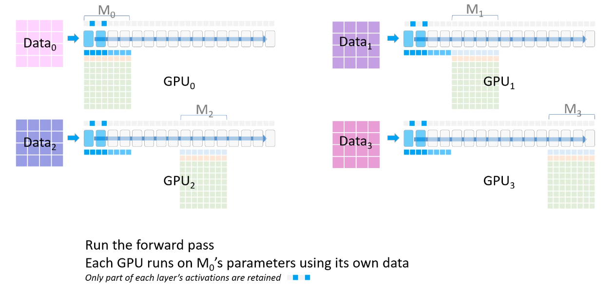

## 前向与反向(Forward and Backward)

### Forward

某两层$(i, i+1)$的forward: 
$$
z^i = a^{i-1}W^i+b^i\\
a^i=f(z^i)\\
---------\\
z^{i+1} = a^{i}W^{i+1}+b^{i+1}\\
a^{i+1}=f(z^{i+1})\\
$$

loss计算如下, 其中$a^n$表示最后一层的输出: 
$$
loss=L(a^n, label)
$$

### Backward

中间第$i$层的参数$W^i$的梯度: 
$$
\frac{\partial L}{\partial W^i}=\frac{\partial L}{\partial a^i}\frac{\partial a^i}{\partial z^i}a^{i-1}\\
\frac{\partial L}{\partial a^{i}}=\frac{\partial L}{\partial a^{i+1}}\frac{\partial a^{i+1}}{\partial z^{i+1}}W^{i+1}\\
$$
求$W^i$的梯度需要: 

- 损失对第$i$层激活值$a^i$的偏导数, $\frac{\partial L}{\partial a^i}$.
  - 需要第$i+1$层损失对激活值$a^{i+1}$的偏导数, $\frac{\partial L}{\partial a^{i+1}}$.
  - 需要第$i+1$层激活函数的偏导数, $\frac{\partial a^{i+1}}{\partial z^{i+1}}$. 
  - 需要第$i+1$的参数, $W^{i+1}$

- 第$i$层激活函数的偏导数, $\frac{\partial a^i}{\partial z^i}$. 
  - 需要第$i$层的净值$z^i$

- 第$i-1$层的激活值, $a^{i-1}$

> **以某一层的角度**
>
> 如果以单层的粒度来说, 对于第$i$层, 其输入为$a^{i-1}$, 有: 
> $$
> z^i = a^{i-1}W^i+b^i\\
> a^i=f(z^i)\\
> $$
>
> - 需要计算的值: 
>
>   - $\frac{\partial L}{\partial W^i}=\frac{\partial L}{\partial a^i}\frac{\partial a^i}{\partial z^i}a^{i-1}$, 用于参数更新, 计算该值需要先计算$\frac{\partial a^i}{\partial z^i}$.
>   - $\frac{\partial L}{\partial a^{i-1}}=\frac{\partial L}{\partial a^i}\frac{\partial a^i}{\partial z^i}W^{i}$, 用于反向传播的下一层(即第$i-1$层)中参数$W^{i-1}$的梯度的计算, 计算该值也需要先计算$\frac{\partial a^i}{\partial z^i}$.
>
> - 需要读取的值: 
>
>   - $z^{i}$, 来自Forward过程计算得到, 用于计算$\frac{\partial a^i}{\partial z^i}$
>
>   - $a^{i-1}$, 来自Forward过程计算得到, 用于计算$\frac{\partial L}{\partial W^i}$
>   - $W^i$, 模型参数, 用于计算$\frac{\partial L}{\partial a^{i-1}}$
>   - $\frac{\partial L}{\partial a^{i}}$, 来自Backward过程上一层(第$i+1$层)计算得到, 用于计算$\frac{\partial L}{\partial W^i}$和$\frac{\partial L}{\partial a^{i-1}}$

## 数据并行(Data Parallelism)

### Baseline

> each worker has a copy of the full model, the input dataset is sharded, and workers aggregate their gradients periodically to ensure that all workers see a consistent version of the weights. 

每个卡都有存有完整的模型, 每个卡独立完成 forward 和 backward, 同步(reduce)所有的**梯度**后, 进行参数更新. 

总的通信量就是**一次对整个模型梯度的reduce**.

### ZeRO-powered data parallelism

ZeRO Data Parallel, ZeRO-powered data parallelism (ZeRO-DP) is described on the following diagram from this [blog post](https://www.microsoft.com/en-us/research/blog/zero-deepspeed-new-system-optimizations-enable-training-models-with-over-100-billion-parameters/) **Post中的视频讲的很清楚!**

> **零冗余优化器(ZeRO)是一种优化数据并行的方法: **
>
> The Zero Redundancy Optimizer (abbreviated ZeRO) is a novel memory optimization technology for large-scale distributed deep learning.
>
> ZeRO removes the memory redundancies across data-parallel processes <u>by partitioning the model states—parameters, gradients, and optimizer state—across data parallel processes instead of replicating them (通过将参数, 梯度, 以及优化器状态分割到不同的设备, 而不是像Baseline一样每个设备都有完整的这些东西)</u>. It uses a dynamic communication schedule during training to share the necessary state across distributed devices to retain the computational granularity and communication volume of data parallelism.

**关于通信量: **

虽然post中说相比于Baseline数据并行, ZeRO的stage1和stage2通信量不变. 总的来说, 不切割模型参数的话, 确实**通信量依旧只有一次对整个模型的梯度的reduce**. 

~~**但个人感觉通信相比于Baseline还是有一点额外的开销, 这来源于模型分层切割, 因此层于层之间需要通信activations, 类似于Pipeline Paralelism.** 但也许底层实现有办法避免这个问题也说不定?~~

每张卡保存自己batch的activations, 不需要通信. activations的梯度也不需要通信. 因为backwards过程需要的前一层的activations以及后一层的activations的梯度都在各自卡上. 

## 流水线并行(Pipeline Parallelism)

### GPipe

[[1811.06965\] GPipe: Efficient Training of Giant Neural Networks using Pipeline Parallelism (arxiv.org)](https://arxiv.org/abs/1811.06965)

[[2104.04473\] Efficient Large-Scale Language Model Training on GPU Clusters Using Megatron-LM (arxiv.org)](https://arxiv.org/abs/2104.04473) !

Pipeline Parallelism（流水并行） 也叫 Inter-Layer (Pipeline) Parallelism. 流水并行是把模型分 layer 划分的不同的设备，以达到切分模型的目的。

> 以下图编码器为例, 就是将$n$个虚线中的layer分到不同的device. 一般这些layer相同的情况下, 平均分到所有device.
>
> 

为了形成流水线，即让不同的设备同时执行不同的 layer，需要把一个 <u>batch</u> 的数据的执行在 batch 维做切分，切分后的数据对应一个 <u>micro batch</u>. 这样第 n 个 micro batch 的数据在一个 <u>pipeline stage</u>（设备）执行时，第 n + 1 个 micro batch 可以在上一个 pipeline stage（设备）执行。这样就可以形成流水线。

如图是一个**4**阶段pipeline, 一个 batch 被拆分为**8**个 micro batch。蓝色代表前向运算，绿色代表后向运算。可以看到 GPipe 是先执行完所有 micro batch 的前向，然后再执行所有 micro batch 的后向，然后在 <u>pipeline flush</u> 处进行一次同步。注意这里假设了后向的计算量是前向的2倍。

图中灰色块表示device空闲, 也称作<u>pipeline bubble</u>.

> pipeline stage: pipeline有几个阶段, 同时也就是用于流水线并行的device数量.
>
> pipeline flush: device同步, 等待一个batch的所有micro batch结束.
>
> pipeline bubble: device idel time, 设备的闲置时间.

形成 pipeline bubble 的原因就是要进行 pipeline flush, 而进行 pipeline flush 是为了保证 <u>Strict optimizer semantics</u>.

> **Strict optimizer semantics**
>
> Strict optimizer semantics是指，一个 batch 内的所有 micro batch 的数据遇到的模型都是同一个版本的, 即在optimizer step(参数更新)之前, 所有micro batch都应已完成forward与backward. 本质就是Gradient Accumulation.

> **Pipeline bubble 分析**
>
> 假设有一个 batch 分为 $m$ 个micro batch, pipeline stage数量为 $p$, 一个 micro batch的前向和反向耗时分别为 $t_f, t_b$.
>
> 对于任何一个device而言, 将计算这一个 batch 的理想耗时(即没有气泡)定义为 $t_{id}$, 有:
> $$
> t_{id} = m\cdot(t_{f}+t_{b})
> $$
> 而实际在GPipe调度下, 每个device在前向和反向过程中都有 $p-1$ 个 bubble. 所有这些bubble的耗时定义为 $t_{pb}$, 有:
> $$
> t_{pb} = (p-1)\cdot(t_{f} + t_{b})
> $$
> *以图为例, 可以看图中的 Device 4, forward开始前有3个forward bubble, backward结束后有3个backward bubble. 以整个 batch 的 forward 结束时刻为分界点, 可以看出 Device 1-3 的 forward bubble 和 backward bubble 与 Device 4 的数量是一样的, 只是气泡的位置不同.*
> 
>这样气泡占比 Bubble time fraction:
> $$
> \frac{t_{pb}}{t_{id}} = \frac{(p-1)}{m}
> $$
> 这样**为了降低气泡占比，就需要 $m \gg p$**. 但是每个 micro bath 前向的 all activations (or just input activations for each pipeline stage when using activation checkpointing) 都需要暂存直到依赖它的后向计算完成，这样 micro batch 数量过多，会导致 high memory footprint. 

### 扩展

针对气泡的优化

1F1B

[Megatron-LM 的分布式执行调研：原理和最佳实践 (notion.site)](https://strint.notion.site/Megatron-LM-86381cfe51184b9c888be10ee82f3812#76e27ad8129949ca9b11b5c85d29b02c)

 [[1806.03377\] PipeDream: Fast and Efficient Pipeline Parallel DNN Training (arxiv.org)](https://arxiv.org/abs/1806.03377) 

[[1806.03377\] PipeDream: Fast and Efficient Pipeline Parallel DNN Training (arxiv.org)](https://arxiv.org/abs/1806.03377)

ZB-H1

[AI Infra论文阅读之将流水线并行气泡几乎降到零（附基于Meagtron-LM的ZB-H1开源代码实现解读）-腾讯云开发者社区-腾讯云 (tencent.com)](https://cloud.tencent.com/developer/article/2390006)

## 模型并行(Model Parallelism)

或者说张量并行(Tensor Parallelism), 本质就是[分块矩阵](https://en.wikipedia.org/wiki/Block_matrix)的计算.

[[1909.08053\] Megatron-LM: Training Multi-Billion Parameter Language Models Using Model Parallelism (arxiv.org)](https://arxiv.org/abs/1909.08053)

定义矩阵 $X\in R^{m\times k}$ 和 $$A\in R^{k\times n}$$, 矩阵相乘有: 
$$
Y \in R^{m\times n} = XA
$$
设并行数为 $p$.

### Row Parallel Linear Layer

将 $X$ 按照列均分为 $p$ 块, 将 $A$ 按照行均分为 $p$ 块:
$$
Y = [X_1, X_2, \cdots, X_p]\cdot\begin{bmatrix} A_1, \\A_2, \\\vdots \\A_p\end{bmatrix}=\sum_{i=1}^p{X_iA_i}
$$
将 $X_iA_i$ 分到不同的 device 上计算

### Column Parallel Linear Layer

将 $A$ 按照列均分为 $p$ 块:
$$
Y = X\cdot[A_1, A_2, \cdots, A_p]=[XA_1, XA_2, \cdots, XA_p]
$$
将 $XA_i$ 分到不同的 device 上计算

> **Tensor Parallelism 的通信**
>
> 
>
> - Row Parallel Linear Layer
>
>   - Forward, 输入: 将 $X$ 分发(split, 每个device 得到的是partition, $X_i$)到 $p$ 个 device. 输出: all-reduce, 所有 $Y_i$ 累加
>   - Backward, 输入: 将 $\frac{\partial L}{\partial Y}$ 分发(identify, 每个device 得到的是integer, $\frac{\partial L}{\partial Y}$)到 $p$ 个device. 输出: all-gather, 收集所有 $\frac{\partial L}{\partial X_i}$ , concat 得到完整的 $\frac{\partial L}{\partial X}$.
>
>   通信量: $[(mk+mn)+(mnp+mk)]\times 2$, 其中2表示半精度浮点数为2B.
>
> - Column Parallel Linear Layer
>
>   - Forward, 输入: 将 $X$ 分发(identify, 每个device 得到的是integer, $X$)到 $p$ 个 device. 输出: all-gather,  收集所有 $Y_i$ , concat得到 $Y$.
>   - Backward, 输入:  将 $\frac{\partial L}{\partial Y}$ 分发(split, 每个device 得到的是partition, $\frac{\partial L}{\partial Y_i}$)到 $p$ 个device. 输出: all-gather, 收集所有 $\frac{\partial L}{\partial X_i}$ , concat 得到完整的 $\frac{\partial L}{\partial X}$.
>
>   通信量: $[(mkp+mn)+(mn+mk)]\times 2$
>
> <u>通信量随着 $p$ 增大而增大, 当 $k=n$ 时, 两种策略的通信量相等.</u>
>
> <u>不管是Row Parallel Linear Layer还是Column Parallel Linear Layer, 整个过程不涉及参数$\frac{\partial L}{\partial A_i}$的通信, 每个 device 只需维护自己的参数.</u>

> **Tensor Parallelism 的读写**
>
> Flops 代表计算量；Bandwidth 代表 Memory access operations；Intensity 代表 Flops/Bandwidth，显示计算操作和内存搬运操作的比例. **Intensity越高往往代表速度更快(因为内存操作的速度比处理器慢得多, 当带宽不是瓶颈时, 应尽量保存不出现处理器等待内存读取的情况)**。
>
> - Serial 模式，矩阵乘法实际需要执行 $n^2$次的(n次乘法 + n次加法):
>   - Flops = （n次乘法 + n次加法）*  $n^2$ 次 = $2n^3$
>   - Bandwidth = (  $n^2$ )【一个 n*n 矩阵的读或写】 * 3【对应读 X、读A，写 Y】 * 2【半精度浮点数字节大小】=  $6n^2$
>   - Intensity = Flops / Bandwidth = $\frac{1}{3}n$
>
> - Column Parallel 模式下（单 device 上的）：
>   - Flops = （n次乘法 + n次加法）* ( $n^2 / p$ )次 =  $2n^3 / p$
>   - Bandwidth = （$n^2$【X矩阵的读】+ $n^2 / p$【A矩阵的读】+ $n^2 / p$【Y矩阵的写】) * 2【半精度浮点数字节大小】) = $2n^2(1+2/p)$
>   - Intensity = Flops / Bandwidth = $\frac{n}{2+p}$
>
> **Ratio between serial and parallel**
> $$
> \text{Intensity Ratio}=\frac{3}{2+p}
> $$
> <u>随着 $p$增加, Intensity 降低.</u>

> **MLP+激活函数**
>
> 

> **两层MLP(MultiLayer Perceptron)**
>
> 

> **多头注意力(Multi-head Attention)**
>
> 

> **嵌入层、交叉熵以及其他(Embedding, Cross entropy and Others)**
>
> 假设输入的 batch-size 为 $b$，输入句子的 token 长度为 $s$。
>
> Input Embedding 和 Output Embedding 共享了参数。设 hidden-size 为 $H$，vocabulary size 为 $v$。 则参数矩阵的 shape 为 $（H, v)$。一般 $v$ 都特别大（万级别），所以选择在 $v$ 上做切分，设分配大小为 $n$。
>
> - 那么对于 Input Embedding 运算，就是一个 Row Parallel， $(b, s, v/n) \cdot (v/n, H)$ 。然后在其后插入一个 all-reduce 操作，把输入转换为 shape 为$(b, s, H)$ 的 Embedding。
>
> - 对于 Output Embedding 运算，其输入是 $(b, s, H)$，要将其转换为 $(b, s, v)$。采用 Column Parallel，这样得到一个按列切分的输出，然后再做一次 all-gather 操作，shape 转换过程为 $(b, s, H) \cdot (H, v/n) → (b, s, v/n)→ all\_gather → (b, s, v)$。但是 $v$ 很大，这导致 all-gather 操作非常耗时，需要同步 $b * s * v$ 个元素。因此得到  $(b, s, v/n)$ 后，延迟通信同步到 Cross entropy loss 之后（训练时使用的是 Cross entropy，在推理时使用的是 Softmax）。**无论训练还是推理都涉及softmax的计算, 但计算softmax需要读取完整的向量, 因此也许用到了[safe softmax online](./加速加速.md###前置知识)技术?**
>
> - 对于 Cross entropy loss 运算，其输入的 shape 是  $(b, s, v/n)$ ，计算负对数似然后输出维度被 reduce 成 $(b, s)$。此时再做 all-reduce 操作得到最终的 Cross entropy loss，而这个 all-reduce 只需要同步 $b*s$ 个元素。
>
> - 对于 Dropout/Layer Norm/Residual connections(即 Add）操作，都没有做并行拆分。比如 Layer Norm 的参数，在每个 GPU 上都是完整的。
>
> 在多卡上，因为模型的参数要么是重复的、要么是局部的，所以在做模型参数更新时是不需要额外通信的。
>
> 上面的切分方式使得整个网络只需要额外插入几个简单的 all-reduce 操作，所以不需要依赖编译器做复杂通信算子选择。

## 3D并行(3D parallelism)

[DeepSpeed: Extreme-scale model training for everyone - Microsoft Research](https://www.microsoft.com/en-us/research/blog/deepspeed-extreme-scale-model-training-for-everyone/)

不同的并行策略需要在这些因素间做权衡：显存占用(Memory footprint)、设备使用率(Usage)、通信量(Communication)。

### 三种并行方式的取舍

#### Data parallelism

**Data parallelism** is a ubiquitous technique in deep learning in which each input batch of training data is split among the data parallel workers. <u>Gradients must be communicated and aggregated after backward propagation to ensure that consistent steps are taken by the optimizer (**必须通信梯度**).</u> Data parallelism has several distinct advantages, including <u>compute efficiency and minimal implementation effort (**计算高效并且实现简单**)</u>. However, <u>data parallelism relies on scaling the batch size with the number of data parallel workers, which cannot be done indefinitely without affecting convergence (**无法在不影响收敛性的前提下无限对batch进行切割**).</u>

- **Memory efficiency:** Data parallelism replicates the model and optimizer across all workers, and therefore is <u>not memory efficient (**内存效率低**)</u>.
- **Compute efficiency:** <u>The amount of computation performed by each worker is constant as we increase the degree of parallelism. Data parallelism can achieve near-perfect scaling at small scales (**计算效率高, 小范围内几乎完美的缩放(线性)**)</u>. However, <u>the communication cost of aggregating gradients among data parallel workers scales with the model size and limits compute efficiency on large models or systems with low communication bandwidth(**但当模型很大或通信带宽不足时, 通信代价会限制计算效率**)</u>. *Gradient accumulation* is a common strategy for amortizing this communication cost by further increasing the batch size and performing multiple forward and backward propagations on *micro-batches* while locally accumulating gradients before aggregating and taking an optimizer step.

#### Model Parallelism

**Model Parallelism** is a broad class of techniques that partitions the individual layers of the model across workers. By its nature, the computations and communications of model parallelism are specific to a model architecture and therefore can have large initial implementation effort. Model parallelism reduces the memory proportional to the number of workers. <u>Model parallelism is the most memory efficient among the three types of parallelism at the cost of the lowest compute efficiency. (**模型并行是三种并行中内存效率最高的，但代价是计算效率最低。**)</u>

- **Memory efficiency:** Model parallelism reduces the memory footprint proportional to the number of workers. <u>Crucially, it is the only approach that reduces the activation memory for individual network layers. (**模型并行是唯一的减少单个网络层中activation memory的方法**)</u>
- **Compute efficiency:** <u>Model parallelism has poor computational efficiency due to additional communication of activations in each forward and backward propagation.(**模型并行计算效率很低, 因为需要 activations 的通信**)</u> Model parallelism requires high communication bandwidth to be efficient and does not scale well beyond a single node where the communication bandwidth is limited (**当在多个node进行模型并行时, 因为通信带宽会成为限制, 导致不能很好缩放**). <u>Furthermore, each model-parallel worker decreases the amount of computation performed between each communication stage, impacting compute efficiency. (随着并行数增加, Intensity($\frac{计算}{读写(通信)}$)下降. 这会影响计算效率)</u> Model parallelism is often used in conjunction with data parallelism to trade between memory and compute efficiency.

#### Pipeline parallelism

**Pipeline parallelism** Pipeline parallelism divides the layers of the model into *stages* that can be processed in parallel. As one stage completes the forward pass for a micro-batch, the activation memory is communicated to the next stage in the pipeline. Similarly, as the next stage completes its backward propagation, gradients are communicated backwards through the pipeline.

- **Memory efficiency:** Pipeline parallelism reduces memory proportional to the number of pipeline stages, <u>allowing model size to scale linearly with the number of workers(**允许模型大小与并行数线性扩展**)</u>. <u>However, pipeline parallelism does not reduce the memory footprint for the activations of each layer. Additionally, each worker must store the activations for all micro-batches in flight. (**每个设备要存储一层中整个 batch 的 activation**)</u> In effect, the activation memory on the first stage of the pipeline is approximately the same as the total activation memory for a single micro-batch. A trillion-parameter model would need approximately 19 GB of memory for the activations of a micro-batch, consuming almost half the available memory of the new NVIDIA A100 GPU.

- **Compute efficiency:** <u>Pipeline parallelism has the lowest communication volume since it only communicates data proportional to the activation size of the layers between stage boundaries. (**流水线并行具有最低的通信量，因为它只通信与 "stage 边界之间层的 activations size" 成比例的数据。**)</u> <u>However, it cannot scale indefinitely. Like model parallelism, increasing the pipeline size decreases the computation per pipeline stage, which also decreases the compute-to-communication ratio. (**类似于模型并行, 随并行数的增加, compute-to-communication ratio下降**)</u> <u>Pipeline parallelism also requires each of its stages to be perfectly load balanced to achieve good efficiency. (**需要每个 stage 负载均衡才能高效**)</u>

  <u>Furthermore, pipeline parallelism incurs a bubble overhead from filling and emptying the pipeline at the beginning and end of each training batch. Training with gradient accumulation steps (and thus batch size) that is 4x or 8x the number of pipeline stages achieves 81% and 90% scaling efficiency from one pipeline stage, respectively. (**气泡降低了计算效率**)</u>

### 三种并行方式结合

Achieving both memory and compute efficiency with 3D parallelism

数据、模型和流水线并行性各自在提高内存和计算效率方面发挥着特定的作用。三者结合组成3D并行.

<figure>
  
  <figcaption>Figure 1: Example 3D parallelism with 32 workers. Layers of the neural network are divided among four pipeline stages. Layers within each pipeline stage are further partitioned among four model parallel workers. Lastly, each pipeline is replicated across two data parallel instances, and ZeRO partitions the optimizer states across the data parallel replicas.</figcaption>
</figure>

<figure>
  
  <figcaption>Figure 2: Mapping of workers in Figure 1 to GPUs on a system with eight nodes, each with four GPUs. Coloring denotes GPUs on the same node.</figcaption>
</figure>

*Memory Efficiency:* The layers of the model are divided into pipeline stages, and the layers of each stage are further divided via model parallelism. This 2D combination simultaneously reduces the memory consumed by the model, optimizer, and activations. However, we cannot partition the model indefinitely without succumbing to communication overheads which limits compute efficiency.

*Compute Efficiency:* To allow the number of workers to scale beyond model and pipeline parallelism without sacrificing compute efficiency, we use ZeRO-powered data parallelism (ZeRO-DP). ZeRO-DP not only improves memory efficiency further via optimizer state partition, but also allows scaling to arbitrarily large number of GPUs with minimal communication overhead by exploiting topology aware mapping.

*Topology aware 3D mapping* (Figure 2)*:* Each dimension in 3D parallelism is carefully mapped onto the workers to achieve maximum compute efficiency by exploiting two key architectural properties.

1. **Optimizing for intra- and inter-node communication bandwidth**: <u>Model parallelism has the largest communication overhead of the three strategies, and so we prioritize placing model parallel groups within a node to utilize the larger intra-node bandwidth. (**模型并行通信开销最大, 因此放到一个node中**)</u> Here we apply NVIDIA Megatron-LM for tensor-slicing style of model parallelism. <u>Data parallel groups are placed within a node when model parallelism does not span all the workers in a node.  Otherwise, they are placed across nodes. (**数据并行也优先在node内, 如果模型并行没有吃满一个node的话, 否则就放到多个node**)</u>  <u>Pipeline parallelism has the lowest communication volume, and so we can schedule pipeline stages across nodes without being limited by the communication bandwidth. (**流水线并行需要最少的通信, 因此放到不同node**)</u>
2. **Bandwidth amplification via parallelism in communication:** The size of the gradients communicated by each data parallel group decreases linearly via both pipeline and model parallelism, and thus the total communication volume is decreased from pure data parallelism.  Furthermore, each data parallel group performs its communication independently and in parallel among a subset of localized workers. As a result, the effective bandwidth for data parallel communication is amplified by a combination of reduced communication volume and increased locality and parallelism. (这段话大概就是说, 通过模型并行和流水线并行减少了数据并行的梯度通信size, 因此总的通信量相比于纯数据并行减少了. 此外, 每个数据并行组内的通信是独立且并行的. 总之, 用于数据并行通信的有效带宽增大了.)

## 相关术语

### FLOPs

Floating Point Operations Per Second.

参考：

- Transformer FLOPs 推导. https://zhuanlan.zhihu.com/p/646905171 .

### MFU(Model FLOPs Utilization) and HFU(Hardware FLOPs Utilization)

Model FLOPs(MF) 是指执行一次完整的前后向迭代所需的浮点运算数。注意这里不考虑浮点运算的具体类型还是硬件的限制，反映的时模型本身的固有属性。

Hardware FLOPs(HF) 是指在特定硬件上执行一次完整的前后向迭代实际发生的浮点运算数。

MFU 代表每秒的 Model FLOPs 除以加速器理论上的每秒峰值FLOPs得到的百分比.

HFU 代表每秒的 Hardware FLOPs 除以加速器理论上的每秒峰值FLOPs得到的百分比.

参考：

- nanoGPT 中的 MFU 计算. https://github.com/karpathy/nanoGPT/blob/eba36e84649f3c6d840a93092cb779a260544d08/model.py#L289
- Reducing Activation Recomputation in Large Transformer Models 文章中的 MFU 计算. https://arxiv.org/pdf/2205.05198.pdf

## 参考

[Megatron-LM 的分布式执行调研：原理和最佳实践 (notion.site)](https://strint.notion.site/Megatron-LM-86381cfe51184b9c888be10ee82f3812#5747211492114a9cbad9d367599d4bd5)

[Model Parallelism (huggingface.co)](https://huggingface.co/docs/transformers/v4.15.0/parallelism#data-parallel)
