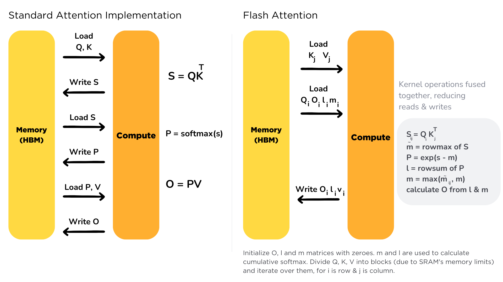
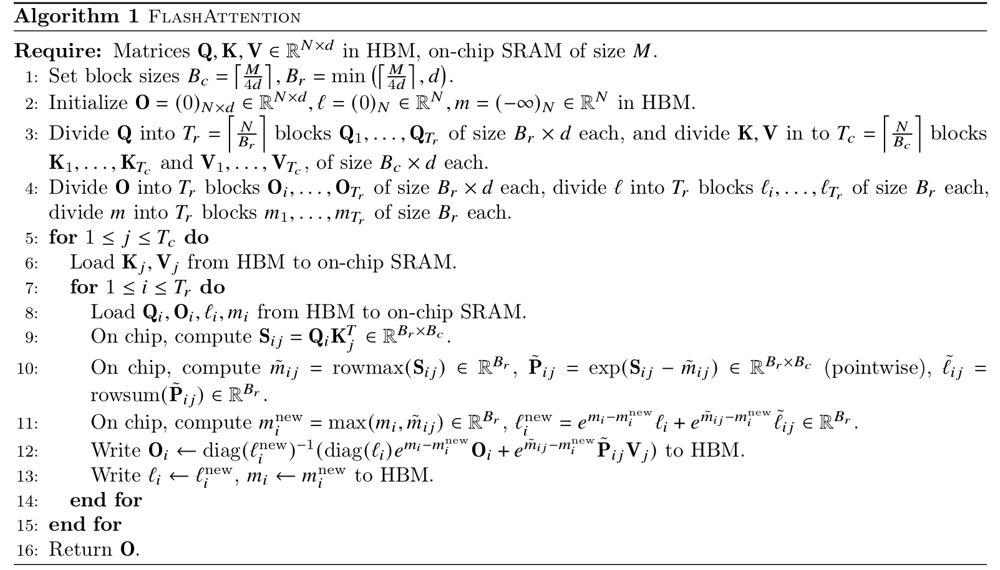

## FlashAttention

### 前置知识

[[1805.02867\] Online normalizer calculation for softmax (arxiv.org)](https://arxiv.org/abs/1805.02867)

**Original softmax**

对于向量中的每个元素, 需要**访问内存3次, 两次读, 一次写**: 

1. **First Load:** Reading the original input value.
2. **Store:** Writing the computed exponential value.
3. **Second Load:** Reading the stored exponential value.

**Safe softmax**

因为取指数可能发生上溢或下溢, 将向量 $x$ 减去最大值(使指数小于等于0)后, 再进行naive softmax可以避免这个问题.

几乎所有的DL框架都使用了safe softmax. 但safe softmax需要额外一次读内存操作来计算最大值 $m_V$. 共**需要访存4次, 三次读, 一次写.**

**Online safe softmax**

将safe softmax的访存次数从4次优化到了3次. 并且可以保证结果与safe softmax一致. 

### 算法

**FlashAttention**能够在**降低显存占用**的同时, **加速训练和推理**.

[[2205.14135\] FlashAttention: Fast and Memory-Efficient Exact Attention with IO-Awareness (arxiv.org)](https://arxiv.org/abs/2205.14135)

[Flash Attention (huggingface.co)](https://huggingface.co/docs/text-generation-inference/conceptual/flash_attention)

1. **提速度**: 通过 fuse operator(将注意力分数的计算以及O的计算融合在一起, 其中注意力分数的计算涉及softmax, 使用的就是**Online safe softmax**), 这样做可以减少对HBM(显存)的读写, 从而加速attention的计算.
2. **降现存: **貌似反向传播过程是显存高效的, 至于为什么, 不想看

**Tiling (分块计算的safe softmax)**

首先, 对于$x\in\mathbb R^B$, safe softmax的计算如下: 
$$
m(x)=\max_i x_i, \\
f(x)=[e^{x_1-m(x)}, \dots, e^{x_B-m(x)}], \\
\mathscr l(x)=\sum_if(x)_i, \\
\text{softmax}=\frac{f(x)}{\mathscr l(x)}
$$
对于 $x\in\mathbb R^{2B}$, 可以将其分为两块, 有 $x=[x^{(1)}, x^{(2)}]$, 其中 $x^{(1)}, x^{(2)}\in \mathbb R^B$, 则有: 

本质上与**Online safe softmax**一样, 计算分块的safe softmax需要 $m(x), l(x)$, 需要维护额外的$m$与$l$. 只不过在此基础上又融入了$O$的计算. 因此attention可以如下方式计算: 外循环按列遍历KV, 内循环按行遍历Q, 计算$O$的同时维护$m$与$l$.

## -

[Transformer Inference Arithmetic | kipply's blog](https://kipp.ly/transformer-inference-arithmetic/)