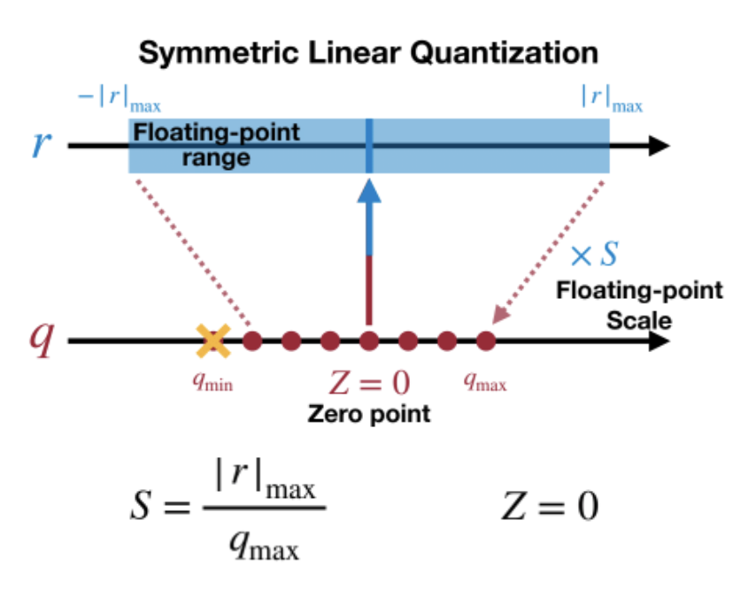
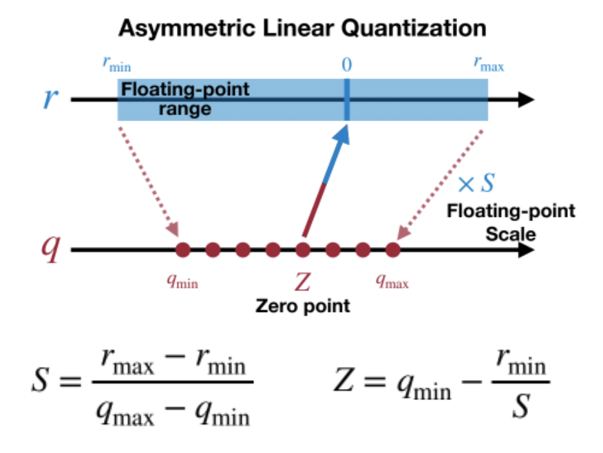
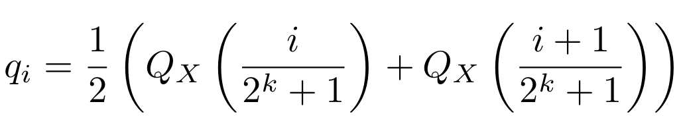
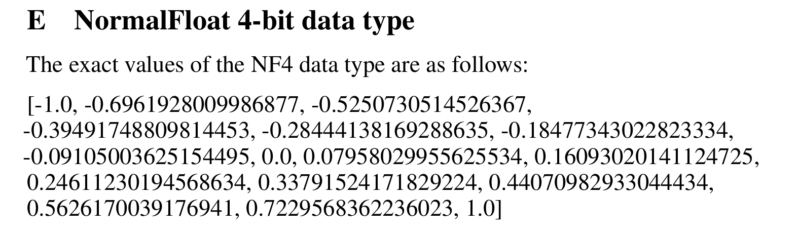
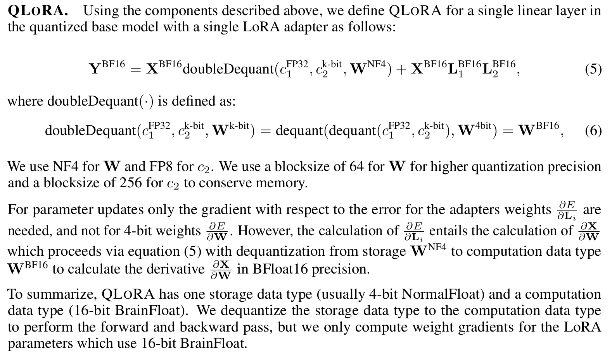
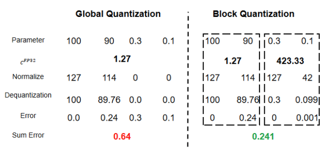
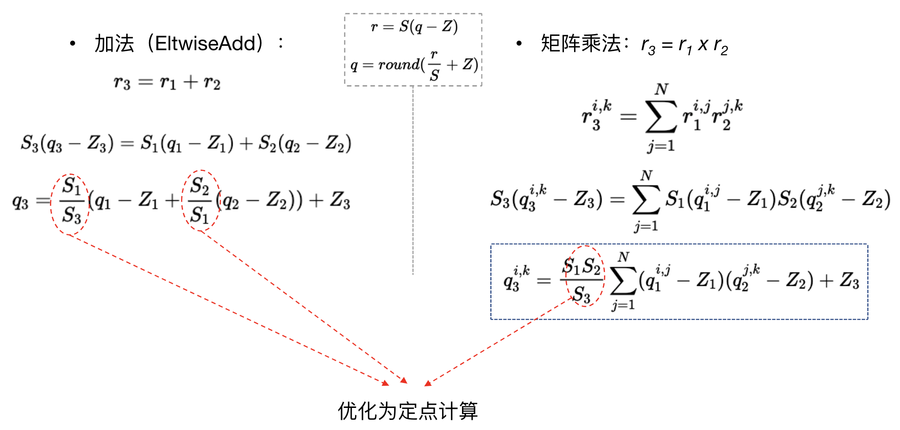

## FP32, FP16和BF16

[15 张图带你深入理解浮点数 (studygolang.com)](https://polarisxu.studygolang.com/posts/basic/diagram-float-point/)

在浮点数表示法中，FP32、FP16 和 BF16 的符号位、指数位和尾数位的位数分别如下：

1. **FP32（单精度浮点数）**：
   - 符号位（Sign bit, S）：1位
   - 指数位（Exponent bits, E）：8位
   - 尾数位（Mantissa bits, M）：23位

2. **FP16（半精度浮点数）**：
   - 符号位（Sign bit, S）：1位
   - 指数位（Exponent bits, E）：5位
   - 尾数位（Mantissa bits, M）：10位

3. **BF16（Brain Float 16）**：
   - 符号位（Sign bit, S）：1位
   - 指数位（Exponent bits, E）：8位
   - 尾数位（Mantissa bits, M）：7位

这些浮点数格式在计算机科学和人工智能领域中被广泛使用，其中FP32常用于精度要求较高的计算，而FP16和BF16则因其较小的存储需求和计算优势，在深度学习模型训练和推理中越来越受欢迎。

**尾数位数决定了精度, 指数位数决定了最值**

**BF16表示范围与FP32一致, 只是精度降低**

## 量化

[模型量化原理与实践 – Robot 9](https://robot9.me/ai-model-quantization-principles-practice/) *

[‌⁠‬‬‌‍⁠‍‍‌⁠⁠⁠‍⁠‬⁠‬⁠QLoRA核心方法 - 飞书云文档 (feishu.cn)](https://s1phnled74d.feishu.cn/docx/RkeXdyVkUoyekIxIxdOcvwBJnZe)

[一个综述 2103.13630 (arxiv.org)](https://arxiv.org/pdf/2103.13630)

### 线性映射

量化与反量化:
$$
Q = \text{round}(\frac R S + Z)\\
R = S(Q-Z)
$$
其中 $Q, R$ 分别是量化后、前的数，$S$ (Scale)和 $Z$ (Zero-Point)是<u>量化系数</u>.

线性映射又可以分为<u>对称映射</u>和<u>非对称映射</u>. 两种映射方法的量化系数 $S, Z$ 的计算如下: 

<figure>
  
  <figcaption style="text-align: center; margin-top: 10px;">Figure 1: 对称映射的量化系数</figcaption>
</figure>

对称映射的 $Z$ 始终为 0， 即原数值的 0 量化后仍然是 0，量化前后的数值都是以 0 为中点对称分布，但实际上有些数值的分布并不是左右对称的，比如 ReLU 激活后都是大于 0，这样会导致量化后 $Q$ 的范围只用到了一半，而非对称映射则解决了这个问题：

<figure>
  
  <figcaption style="text-align: center; margin-top: 10px;">Figure 2: 非对称映射的量化系数</figcaption>
</figure>

非对称映射的 min、max 独立统计，$Z$ 的值根据 $R$ 的分布不同而不同，这样可以使 $Q$ 的范围被充分利用。

> 🌰 例子
>
> 量化 FP32 $R=[-1.8, -1.0, 0, 0.5]$ 到 INT8 [0, 255] (非对称)：
>
> 1. rmin = -1.8，rmax = 0.5， bitWidth = 8
> 2. S = (rmax – rmin)/(qmax – qmin) = (0.5 – (-1.8)) / (255 – 0) = 0.009019607843
> 3. Z = qmin – rmin/S = 0 – (-1.8)/S = 199.56521739 ≈ 200
> 4. 量化结果：$Q = \text{round}([-1.8, -1.0, 0, 0.5] / S + Z) = [0, 89, 200, 255]$
>
> 反量化：
>
> 1. $R' = S * ([0, 89, 200, 255] – Z) = [-1.80392157, -1.00117647, 0, 0.49607843]$
>
> 可以看到：反量化后数值对比原始数值存在一定误差。

### 非线性映射

主要介绍<u>分位量化 (Quantile Quantization)</u>: 分位量化的基本想法是寻找一些<u>分位点</u>对原数据进行划分，使得各个区间的数据个数相等，然后将同一个区间的数据映射到同一个值，从而实现了量化。

分位点估计是通过 input tensor 的<u>经验累计分布函数</u>估计得到的. 因此分位点估计过程的成本较高, 为此提出了快速分位点估计算法, 如 SRAM quantiles. 但这些算法会导致对离群值的量化误差很大, 而离群值又往往是一些很重要的值.

[QLoRA](https://arxiv.org/pdf/2305.14314) 中的 <u>NormalFloat (NF)</u> data type就是一种分位量化的实现, 并且其同时解决了 Expensive quantile estimates 和 Approximation errors 问题.

>  We present QLORA, an efficient finetuning approach that reduces memory usage enough to finetune a 65B parameter model on a single 48GB GPU while preserving full 16-bit finetuning task performance. 

> **就当他说的对**
>
> 对于任意标准差σ在[−1,1]范围内的零均值正态分布，信息理论最优 data type 计算如下: 
>
> 1. 估计标准正态分布 $N(0, 1)$ 的 $2^k+1$ 个分位点, 从而得到对标准正态分布进行 k-bit 分位量化的 data type
> 2. 把这个 data type 中的值normalize到[1-, 1]之间
>
> 公式: 
>
> 
>
> 其中$Q_X$ 是累积分布函数的反函数.
>
> 
>
> **事实上, QLoRA为了保证0量化后依然是0进行了特殊处理, 感兴趣可以看原文*

量化步骤: 

1. 通过最大绝对值的重新缩放，将input weight tensor 归一化为[−1,1]范围: 
   $$
   s=\max(\text{abs}(r)),\\ r=r/s
   $$

2. 找到最接近 $r_i$ 的 $q_i$ , 取 $q_i$ 的 index, 量化结果是 $q_i$ 的 index.
   $$
   \text{map}(r_i)\rarr q_i,  \\
   \text{index}(q_i) \rarr i
   $$

步骤1相当于把 input tensor 的标准差放缩到与 k-bit data type 的标准差一致, (好像就是把 input tensor 的标准差 scale 到[-1, 1]).

> Since pretrained neural network weights usually have <u>a zero-centered normal distribution with standard deviation σ</u> (see Appendix F), we can <u>transform all weights to a single fixed distribution by scaling σ such that the distribution fits exactly into the range of our data type.</u> For our data type, we set the arbitrary range [−1,1]. As such, both the quantiles for the data type and the neural network weights need to be normalized into this range.

反量化步骤: 

1. 根据 index 找到对应的 $q_i$
2. 反归一化(乘 $s$), $r'=q_i\times s$

> 🌰 例子
>
> 量化: 
>
> 1. 原始输入数据：[-5, 3, 16, 8]
> 2. 计算归一化常数 s = max(abs(xi)) = 16
> 3. 将输入数据归一化到 [-1, 1]：[-5, 3, 16, 8] / s = [-0.3125, 0.1875, 1.0, 0.5]
> 4. 从NF4中找到最接近的分位数qi, 将索引作为量化结果：[4, 9, 15, 12]
>
> 反量化：
>
> 1. 将量化结果作为索引从NF4中找到对应分位数[4, 9, 15, 12] -> [-0.28444138169288635, 0.16093020141124725, 0.7229568362236023, 0.33791524171829224]
> 2. 将分位数反归一化(乘以s)：[-4.551062107, 2.574883223, 16, 7.051357269]

QLoRA实际上还进了二次量化, Double Quantization, 就是对第一次量化的<u>量化常量</u>进行量化.

> **QLoRA的训练**
>
> 模型参数$W$用NF4, 量化常量$c_2$用FP8(即图中的 $\text{k-bit}=\text{FP8}$ ), 量化常量 $c2$ 的量化常量用FP32. 可训练参数 $L_1, L_2$ 用 BF16.
>
> 训练时, 只求$L_i$的梯度$\frac{\partial E}{\partial \boldsymbol{L_i}}$, 但计算 $\frac{\partial E}{\partial \boldsymbol{L_i}}$ 需要求
>
> 

## 量化粒度

量化粒度指选取多少个待量化参数共享一个量化系数. 通常来说粒度越大，精度损失越大，而量化粒度越小，虽然精度更高, 但需要额外存储的量化系数就越多.

如下四个数 [100, 90, 0.3, 0.1]以<u>对称映射</u>的方式量化到 INT8，如果4个数一起量化，最终误差为 0.64，而如果分为两组分别量化，则最终误差只有 0.241，从这里也可以看出，通过将**值域范围接近的数**进行**分组量化**，能降低量化误差。

其中 $c^{FP32}=\frac1 S$.

## 量化计算

[模型量化原理与实践 – Robot 9](https://robot9.me/ai-model-quantization-principles-practice/)

硬件的整型/定点计算通常比浮点计算更快，因此量化到整型/定点后，有利于推理性能的提升，

可以看到，线性量化后，q、z 相关的都是整型计算，但仍然会有量化系数 S(FP32)的计算，这部分(图中红圈)也可以优化为定点计算来提升速度

## 算子融合

[模型量化原理与实践 – Robot 9](https://robot9.me/ai-model-quantization-principles-practice/)

算子融合(fuse)是将多个算子合并成一个，从而加速计算过程，也能一定程度减少量化误差，常见的融合组合有：

- [conv, bn]、[conv, bn, relu]、[conv, relu]
- [linear, relu]、[bn, relu]

## 模型量化方法

[模型量化原理与实践 – Robot 9](https://robot9.me/ai-model-quantization-principles-practice/)

模型的量化对象主要分权重和激活两类：

- 权重：训练完后固定，数值范围(range)与输入无关，可离线完成量化，通常相对容易量化；
- 激活：激活输出随输入变化而变化，需要统计数据动态范围，通常更难量化。范围统计的时机有两种：
  - training：训练时进行统计
  - calibration：训练后推理小批量数据进行统计

根据是否重新训练模型，量化方案主要分位两大类：

- Post Training Quantization （PTQ）

  训练后量化，相对简单高效，只需要已训练好的模型 + 少量校准数据，无需重新训练模型，根据是否量化激活又分为：

  - Dynamic Quantization：仅量化权重，激活在推理时量化，无需校准数据
  - Static Quantization：权重和激活都量化，需要校准数据

- Quantization Aware Training（QAT）

  量化感知训练：在模型中添加伪量化节点模拟量化，重新训练模型（finetune），流程相对复杂

## FAQ

1. 模型量化后, 推理是否会变慢

   ChatGPT

   模型量化后，推理速度通常会变快而不是变慢。这是因为量化通过将模型参数从高精度（例如32位浮点数）转换为低精度（例如8位整数），减少了计算量和内存使用，从而提高了计算效率。然而，这也可能会导致模型精度的略微下降。量化后的模型在硬件（例如CPU或GPU）上运行时，通常能够更好地利用这些硬件的整数计算能力，因此总体推理速度往往会有所提升。

2. 但量化后的模型在推理使需要反量化, 也就使需要额外乘某个量化常数, 这不会导致耗时增加吗

   ChatGPT

   量化后的模型确实需要在推理时进行反量化操作，但这通常不会显著增加计算时间。以下几点解释了原因：

   1. **反量化操作简单**：反量化操作通常涉及简单的乘法和加法。这些操作在现代处理器上非常高效，即使在推理过程中需要反量化，它们所占用的计算时间相对较少。
   2. **硬件加速**：许多现代硬件，包括CPU和GPU，特别是那些专门为深度学习优化的硬件（如NVIDIA的Tensor Cores），都有专门的指令集和硬件加速支持量化操作和反量化操作。这使得这些操作在硬件层面上非常高效。
   3. **整体效率提升**：尽管反量化可能增加一些计算开销，但量化后模型整体减少了存储需求和内存带宽消耗，大大减少了数据传输和处理的瓶颈。因此，整体推理速度通常会提升。

   因此，尽管反量化操作存在，但它带来的额外开销通常被量化模型带来的其他效率提升所抵消，最终结果是量化模型的推理速度通常会更快。

3. 那么为了节省内存, 模型在训练时进行量化, 是否会导致训练变慢

   ChatGPT

   在训练过程中进行量化确实会带来一些额外的计算开销和复杂性，从而可能导致训练变慢。以下是一些主要原因：

   1. **反量化和重新量化**：在训练过程中，每次权重更新后，量化模型需要不断地进行反量化和重新量化操作，这会增加额外的计算负担。
   2. **梯度计算复杂度增加**：量化模型在计算梯度时可能需要进行更多的近似和调整，以确保量化操作对梯度计算的影响最小。这会增加计算复杂度。
   3. **稳定性和精度问题**：量化会引入噪声和误差，可能会导致训练过程中的数值稳定性问题。这可能需要额外的处理步骤或训练技巧（例如更低的学习率、更频繁的检查点保存）来确保模型的收敛性和性能。
   4. **优化器调整**：量化模型的训练过程可能需要特别设计或调整优化器，以适应量化后的权重和梯度。这也会增加训练的复杂性。

   尽管在训练过程中量化可能带来这些挑战和潜在的速度下降，但量化训练也有一些潜在的优势，如降低内存使用和减小模型大小，这在某些资源受限的环境中可能是非常有价值的。实际上，业界也在积极研究和开发各种量化训练技术，以减小这些负面影响并提高量化训练的效率。
