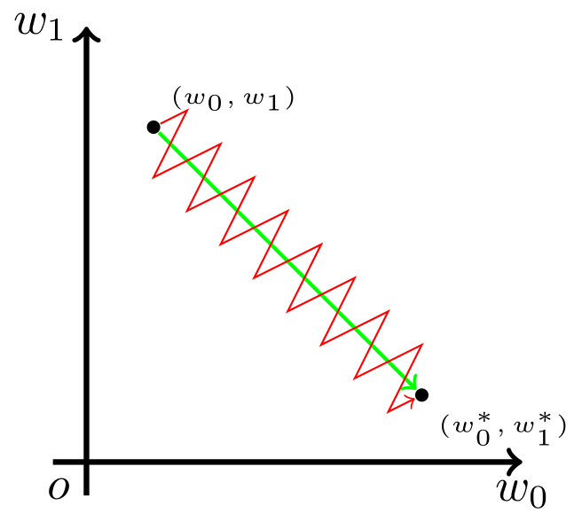

## 参数初始化

标准的初始化策略的推导是基于概率统计的，大概的思路是<u>假设输入数据的均值为0、方差为1，然后期望输出数据也保持均值为0、方差为1，然后推导出初始变换应该满足的均值和方差条件。</u>

[从几何视角来理解模型参数的初始化策略 - 科学空间|Scientific Spaces](https://spaces.ac.cn/archives/7180)

从代数角度, 目标都是要求保持**输入和输出的方差一致**

[浅谈Transformer的初始化、参数化与标准化 - 科学空间|Scientific Spaces](https://spaces.ac.cn/archives/8620)

从几何的角度, 目标是保持**输入和输出的模长一致**

其实也很好理解, 均值为0时, 模长 $^2$ =方差

### 前置知识

> **推论1**： 高维空间中的任意两个随机向量几乎都是垂直的。
>
> **推论2**： 从 $\mathcal{N}(0, 1/n)$ 中随机选取 $n^2$ 个数，组成一个 $n\times n$ 的矩阵，这个矩阵近似为正交矩阵，且 $n$ 越大，近似程度越好。
>
> **推论3**： 从任意的均值为0、方差为 $1/n$ 的分布 $p(x)$ 中独立重复采样出来的 $n\times n$ 矩阵，都接近正交矩阵。

<u>正交矩阵的重要意义在于它在变换过程中保持了向量的模长不变</u>. 用数学公式来表达，就是设 $\boldsymbol{W}\in \mathbb{R}^{n\times n}$ 是一个正交矩阵，而 $\boldsymbol{x}\in\mathbb{R}^n$ 是任意向量，则 $\boldsymbol x$ 的模长等于 $\boldsymbol{W}\boldsymbol{x}$ 的模长：

$$
\begin{equation}\Vert\boldsymbol{W}\boldsymbol{x}\Vert^2 = \boldsymbol{x}^{\top}\boldsymbol{W}^{\top}\boldsymbol{W}\boldsymbol{x}=\boldsymbol{x}^{\top}\boldsymbol{x}=\Vert\boldsymbol{x}\Vert^2\end{equation}
$$

### Xavier初始化, He初始化

对于全连接层: 

$$
\begin{equation}\boldsymbol{y}=\boldsymbol{W}\boldsymbol{x} + \boldsymbol{b}\end{equation}
$$

深度学习模型本身上就是一个个全连接层的嵌套，所以为了使模型最后的输出不至于在初始化阶段就过于“膨胀”或者“退化”，一个想法就是<u>让模型在初始化时能保持模长不变。</u>

这个想法形成的一个自然的初始化策略就是==“以全零初始化 $b$ ，以随机正交矩阵初始化 $W$ ”==。而**推论2**就已经告诉我们，从 $\mathcal{N}(0, 1/n)$ 采样而来的 $n\times n$ 矩阵就已经接近正交矩阵了，所以我们可以从 $\mathcal{N}(0, 1/n)$ 采样来初始化 $W$ 。这便是<u>Xavier初始化</u>策略. 此外，采样分布也不一定是 $\mathcal{N}(0, 1/n)$ ，前面**推论3**说了你可以从任意均值为0、方差为 $1/n$ 的分布中采样.

上面说的是输入和输出维度都是 $n$ 的情况，如果输入是 $n$ 维，输出是 $m$ 维呢？这时候 $\boldsymbol{W}\in\mathbb{R}^{m\times n}$ ，保持 $\boldsymbol{W}\boldsymbol{x}$ 模长不变的条件依然是 $\boldsymbol{W}^{\top}\boldsymbol{W}=\boldsymbol{I}$ 。然而，当 $m < n$ 时，这是不可能的；当 $m \geq n$ 时，这是有可能成立的，并且根据前面相似的推导，我们可以得到

**推论4**： 当 $m \geq n$ 时，从任意的均值为0、方差为 $1/m$ 的分布 $p(x)$ 中独立重复采样出来的 $m\times n$ 矩阵，近似满足 $\boldsymbol{W}^{\top}\boldsymbol{W}=\boldsymbol{I}$ 

所以，如果 $m>n$ ，那么只需要把采样分布的方差改为 $1/m$ 就好，至于 $m<n$ 时，虽然没有直接的推导，但仍然可以沿用这个做法，毕竟合理的策略应该是普适的。注意，这个改动跟Xavier初始化的原始设计有点不一样，它是“LeCun初始化”的对偶版本（<u>LeCun初始化</u>方差是 $1/n$ ），而Xavier初始化的方差则是 $2/(m+n)$ ，这平均了前向传播和反向传播的直觉做法，而我们这里主要考虑的是前向传播。

这里只是考虑了没有激活函数的场景，就算 $y$ 的模长跟x一样，但 $y$ 经过激活函数后就不一样了。确实是存在这样的情况，而且这时候只能针对具体问题具体分析。比如 $\text{tanh}(x)$ 在 $x$ 比较小的时候有 $\text{tanh}(x)\approx x$ ，所以可以认为Xavier初始化直接适用于 $\text{tanh}(x)$ 激活；再比如 $\text{Relu}$ 时可以认为 $\text{Relu}(y)$ 会有大约一半的元素被置零，所以模长大约变为原来的 $1/\sqrt 2$ ，而要保持模长不变，可以让 $W$ 乘上 $\sqrt 2$ ，也就是说初始化方差从 $1/m$ 变成 $2/m$ ，这就是何凯明大神提出来的针对 $\text{Relu}$ 的初始化策略, <u>He初始化</u>。

当然，事实上很难针对每一个激活函数都做好方差的调整，所以一个更通用的做法就是直接在激活函数后面加上一个类似**Layer Normalization**的操作，直接显式地恢复模长。这时候就轮到各种Normalization技巧登场了～

## 逐层归一化(Normalization)

[归一化 BN、LN、Pre-Norm、Post-Norm、Deep-Norm - 飞书云文档 (feishu.cn)](https://f0yif751ier.feishu.cn/docx/JlMLdE7skopWXLxd7P0cBO2Ynpf)

逐层归一化可以有效提高训练效率的原因有以下几个方面(@邱锡鹏): 

1. 更好的尺度不变性: 给定一个神经层𝑙，它之前的神经层(1,⋯,𝑙−1)的参数变化会导致其输入的分布发生较大的改变. 当使用随机梯度下降来训练网络时，每次参数更新都会导致该神经层的输入分布发生改变．越高的层，其输入分布会改变得越明显. 从机器学习角度来看，如果一个神经层的输入分布发生了改变，那么其参数需要重新学习，这种现象叫作<u>内部协变量偏移</u>. 逐层归一化操作缓解了这个问题.

   把每个神经层的输入分布都归一化为标准正态分布，可以使得每个神经层对其输入具有更好的尺度不变性, 有利于更加高效地进行参数初始化以及超参选择

2. 更平滑的优化地形: 逐层归一化一方面可以使得大部分神经层的输入处于不饱和区域，从而让梯度变大，避免梯度消失问题；另一方面还可以使得神经网络的优化地形（Optimization Landscape）更加平滑，以及使梯度变得更加稳定，从而允许我们使用更大的学习率，并提高收敛速度

对于一个深度神经网络的第 $l$ 层, 有:

$$
a^{(l)}=f(z^{(l)})=f(Wa^{(l-1)}+b)
$$

其中 $f(\cdot)$ 是激活函数, $W, b$ 是参数.

在实践中归一化操作一般应用在仿射变换（Affine Transformation） $𝑾𝒂^{(𝑙−1)} + 𝒃$ 之后、激活函数之前．

### 批归一化(Batch Normalization, BN)

在batch维对 $z$ 采样<u>标准化(z-score标准化)</u>

**训练时:** 对于batch size = $K$ , 用 $z^{(k, l)}$ 表示 $l$ 层第 $k$ 个样本的 $z$ 值<u>(是一个张量)</u>, BN操作如下: 

$$
\mu=\frac 1 {K}\sum_{k=1}^K{z^{(k, l)}}\\
\sigma^2=\frac 1 {K}\sum_{k=1}^K{(z^{(k, l)}-\mu)\odot(z^{(k, l)}-\mu)}\\
\hat z^{(l)}=\frac{z^{(l)}-\mu}{\sqrt{\sigma^2+\epsilon}}
$$

其中, == $\mu, \sigma ^2$ 都是张量==. 另外, $\mu, \sigma ^2$ 也可以是滑动平均求得.

标准化到标准正态分布有一个问题, 它会使得**取值集中到0附近**，如果使用**Sigmoid型激活函数**时，这个取值区间刚好是**接近线性变换的区间**，**减弱了神经网络的非 线性性质**．因此，为了使得归一化不对网络的表示能力造成负面影响，可以通过一个附加的缩放和平移变换改变取值区间．最终BN定义为: 

$$
\text{BN}_{\gamma,\beta}(z^{(l)}) \triangleq \frac{z^{(l)}-\mu}{\sqrt{\sigma^2+\epsilon}}\odot \gamma+\beta\\
$$

其中 $\gamma, \beta$ 是可学习参数. 最保守情况下, 当 $\gamma=\sqrt{\sigma^2}, \beta=\mu$ 时, 有 $\text{BN}_{\gamma,\beta}(z^{(l)})=z^{(l)}$ .

**推理时:** 训练完成后, 在推理时, 用整个训练集上的均值和方差代替batch的均值方差.

> 值得一提的是，**逐层归一化不但可以提高优化效率，还可以作为一种隐形的正则化方法**．在训练时，神经网络对一个样本的预测不仅和该样本自身相关，也 和同一批次中的其他样本相关．由于在选取批次时具有随机性，因此使得神经网 络不会“过拟合”到某个特定样本，从而提高网络的泛化能力

### 层归一化(Layer Normalization, LN)

BN的两个缺点: 

1. 对batch size有一定要求, 不能太小
2. 输入可变时, 如RNN, Transformer等网络, 无法使用

层归一化（Layer Normalization）, LN是对一个中间层的所有神经元进行归一化．相比于BN, 差别就在于如何计算均值和方差. LN均值方差计算方式如下:

$$
\mu=\frac 1 {D}\sum_{d=1}^D{z^{(l)}_d}\\
\sigma^2=\frac 1 {D}\sum_{d=1}^D{(z^{(l)}_d-\mu)^2}\\
\text{LN}_{\gamma,\beta}(z^{(l)}) \triangleq \frac{z^{(l)}-\mu}{\sqrt{\sigma^2+\epsilon}}\odot \gamma+\beta\\
$$

其中, $D$ 代表 $z^{(l)}$ 的维数, 也即 $l$ 层神经元的个数. $z^{(l)}_d$ 表示向量 $z^{(l)}$ 在第 $d$ 维的值<u>(是一个标量)</u>. == $\mu, \sigma ^2$ 都是标量==. 

$\gamma, \beta$ 的shape 为 [D].

另外不同与BN的一点是, **LN在训练和推理时都是使用的输入数据的均值和方差.**

> This layer uses statistics computed from input data in both training and evaluation modes.

> **Pytorch实例**
>
> ```python
> # NLP Example
> batch, sentence_length, embedding_dim = 20, 5, 10
> embedding = torch.randn(batch, sentence_length, embedding_dim)
> layer_norm = nn.LayerNorm(embedding_dim)
> # Activate module
> layer_norm(embedding)
> 
> 
> # Image Example
> N, C, H, W = 20, 5, 10, 10
> input = torch.randn(N, C, H, W)
> # Normalize over the last three dimensions (i.e. the channel and spatial dimensions)
> # as shown in the image below
> layer_norm = nn.LayerNorm([C, H, W])
> output = layer_norm(input)
> ```
>
> Unlike Batch Normalization and Instance Normalization, which applies scalar scale and bias for each entire channel/plane with the `affine` option, Layer Normalization applies per-element scale and bias with `elementwise_affine`.
>
> 对上面这段话的理解: 实际上BN和LN还有一点不同, 以Image Example为例, 代码中创建的layer_nrom中, 可学习参数 $\mu, \gamma$ 是的shape将会是[C, H, W]. 而如果是使用BN, 则对于的代码应为`batch_norm = nn.BatchNorm2d(C)`, 此时对应的可学习参数的shape为[C]

### 均方根层归一化(Root Mean Square Layer Normalization, RMS LN)

[3454287.3455397 (acm.org)](https://dl.acm.org/doi/pdf/10.5555/3454287.3455397)

> Used in LLAMA2

也是一种LN, 是指归一化的方式不同, LN使用<u>标准化(z-score标准化)</u>, 而它使用RMS

$$
\text{RMS}(z) = \sqrt{\frac 1 D \sum_{d=1}^D{z^2_d+\epsilon}}= D^{-\frac 1 2}||z||\\
\text{RMS\_LN}_{\gamma}(z^{(l)}) \triangleq \frac{z^{(l)}}{{\text{RMS}(z^{(l)})}}\odot \gamma\\
$$

其中 $\gamma$ 是可学习参数. 

感觉就像是把 $z$ 归一化到了某个半径为 $D^{\frac 1 2}\gamma$ 的超球面. 因为 $\text{RMS\_LN}_{\gamma}(z^{(l)}) \triangleq \frac{z^{(l)}}{{\text{RMS}(z^{(l)})}}\odot \gamma=\frac{z}{||z||}\odot D^{\frac 1 2}\gamma$ , 其中 $\frac{z}{||z||}$ 是单位超球面上的一个向量, 那么当 $\gamma$ 是标量时, $D^{\frac 1 2}\gamma$ 就可以视为半径. 不过实际上应该按照LN中的做法, $\gamma$ 是张量. 不知道是否改为改为标量会更好?

### Deep Norm todo

[[2203.00555\] DeepNet: Scaling Transformers to 1,000 Layers (arxiv.org)](https://arxiv.org/abs/2203.00555)

### 关于归一化与残差(Normalization and Residual)

> LLAMA2 用了Pre normalization, 几乎现在所有的开源大模型都在使用Pre Normalization.

$$
\begin{align} 
\text{Pre Norm: } \quad \boldsymbol{x}_{t+1} = \boldsymbol{x}_t + F_t(\text{Norm}(\boldsymbol{x}_t))\\ 
\text{Post Norm: }\quad \boldsymbol{x}_{t+1} = \text{Norm}(\boldsymbol{x}_t + F_t(\boldsymbol{x}_t)) 
\end{align}
$$

- 一般来说, Post Norm的效果会优于Pre Norm, 特别是在微调中. 而在预训练中可能差不多.

  > **原因:** Pre Norm的深度有“水分”！也就是说，一个𝐿层的Pre Norm模型，其实际等效层数不如𝐿层的Post Norm模型，而层数少了导致效果变差了。Pre Norm中多层叠加的结果更多是增加宽度而不是深度，层数越多，这个层就越“虚”。说白了，Pre Norm结构无形地增加了模型的宽度而降低了模型的深度，而我们知道深度通常比宽度更重要，所以是无形之中的降低深度导致最终效果变差了。而Post Norm刚刚相反，在[《浅谈Transformer的初始化、参数化与标准化》](https://kexue.fm/archives/8620)中我们就分析过，它每Norm一次就削弱一次恒等分支的权重，所以Post Norm反而是更突出残差分支的，因此Post Norm中的层数更加“足秤”，一旦训练好之后效果更优。

  [为什么Pre Norm的效果不如Post Norm？ - 科学空间|Scientific Spaces (kexue.fm)](https://kexue.fm/archives/9009)

- 但Post Norm通常更难以训练, 一般要求加Warmup.

  > **原因:** Post Norm结构，它也是原版Transformer和BERT所使用的设计。然而，这种做法虽然稳定了前向传播的方差，但事实上已经严<u>重削弱了残差的恒等分支，所以反而失去了残差“易于训练”的优点</u>，通常要warmup并设置足够小的学习率才能使它收敛。
  >
  > [浅谈Transformer的初始化、参数化与标准化 - 科学空间|Scientific Spaces (kexue.fm)](https://kexue.fm/archives/8620#残差连接)

## 注意力机制(Attention)

### 多头注意力(Multi-query attention)

pass

### 组注意力(grouped-query attention) todo

> Used in LLAMA2

## 激活函数

### sigmoid与tanh函数

sigmoid:

$$
\sigma(x)=\frac{1}{1+e^{-x}}
$$

sigmoid导数: 

$$
\sigma'(x)=\sigma(x)(1-\sigma(x))
$$


tanh: 

$$
\text{tanh}(x)=2\sigma(2x)-1=\frac{e^x-e^{-x}}{e^x+e^{-x}}
$$

tanh导数:

$$
\text{tanh}'(x)=1-\text{tanh}^2(x)
$$


两个函数的图像和导数的图像长得比较相似, 因此也有一些相似的性质

优点

1. 平滑
2. 易于求导

缺点

1. 幂运算相对耗时
2. 导数值小于 1，反向传播易导致梯度消失（Gradient Vanishing）

> [!Tip]
> **不同点**
>
> 最主要不同点是它们一个是非中心化函数另一个是中心化函数 参考: [谈谈激活函数以零为中心的问题 | 始终 (liam.page)](https://liam.page/2018/04/17/zero-centered-active-function/)
>
> 总的来说就是因为sigmoid函数是输出恒为正, 会导致对参数 $ w$ 求梯度时, 各个维度的梯度方向都一样. 
>
> 例如对于神经网络的第 $i$ 层:
> $$
> z^i=w^ix^{i-1}+b^i\\
> x^i=f(z^i)\\
> \frac{ \partial loss }{ \partial w^i }=\frac{ \partial loss }{ \partial x^i }\frac{ \partial x^i }{ \partial z^i }x^{i-1}
> $$
> 可以看出, 如果激活函数 $f$ 的值恒为正, 则 $x^{i-1}$ 的各个维度都为正, $\frac{ \partial x^i }{ \partial z^i }$ 的各个维度都为正, ,进而loss对 $w$ 的偏导数在各个维度的方向将与 $\frac{ \partial loss }{ \partial x^i }$ 一致, 而在某些情况下(虽然可以硬凑出这种极端情况, 但感觉出现的概率应该很小), $\frac{ \partial loss }{ \partial x^i }$ 是可能所有维度要么都为正, 要么都为负的. 
>
> 那么就会出现下图中这种情况, 其中 $(w_0, w_1)$ 表示初始参数值, $(w_0^*, w_1^*)$ 表示最优参数值
>
> 

### ReLU和Leaky ReLU函数

ReLU

$$
\text{ReLU}(x)=\max(0, x)
$$


优点

1. 解决了gradient vanishing问题 (在正区间)
2. 计算速度非常快，只需要判断输入是否大于0
3. 收敛速度远快于sigmoid和tanh

缺点

1. 非零中心化的
2. Dead ReLU Problem, 大概就是异常数据导致异常梯度, 导致更新后参数异常, 导致对于正常的数据, 这些神经元的激活值恒为负, 梯度恒为0.

*现在神经网络通过合理的初始化方法以及batch normal和layer normal等归一化操作, 基本可以避免dead问题, 因此ReLU现在依旧使用非常广泛.*

Leaky ReLU

$$
\text{LeakyReLU}(x)=\max(0.01x,x)
$$

虽然Leaky ReLU理论上解决了Dead问题, 实际实验中并没有被证明一定比ReLU好. (感觉用的也不多)

### Softmax函数

$$
\displaystyle \sigma (\mathbf {z} )_{j}={\frac {e^{z_{j}}}{\sum _{k=1}^{K}e^{z_{k}}}} \ \ \ \ \ \text{for}\ j = 1, …, K.
$$

### SiLU函数(Sigmoid-Weighted Linear Units)

[1702.03118 (arxiv.org)](https://arxiv.org/pdf/1702.03118)


函数:

$$
f(x)=x\cdot\sigma(x)
$$

导数:

$$
f^{\prime}(x)= f(x)+\sigma(x)(1-f(x))
$$

### GELU函数(Gaussian Error Linear Units)

[原论文: 1606.08415v5 (arxiv.org)](https://arxiv.org/pdf/1606.08415v5)

组合了Dropout, zoneout(RNN中的dropout, 好像就是随机保持一些激活值为上一时刻的值), 和ReLU.

Dropout: 随机将一些输入值乘0

ReLU: 确定性的将一些输入的值乘1或者0

GELU: 也是将输入乘1或者0, 但是乘1还是乘0是随机决定的, 且这个随机过程又依赖于输入. 具体的, 就是将 $x$ 乘上随机变量 $m\sim \text{Bernoulli}(\Phi(x))$ , 其中 $\Phi(x)=P(X\le x), x\sim \mathcal N(0, 1)$ 是标准正态分布的累积分布函数(CDF). 这里选择正态分布, 是因为 $x$ 通常是服从正态分布的, 特别是经过Batch Normalization后. 

在这种设置下, $x$ 越小, $m$ 就越有可能为0, 相当于 $x$ 越有可能被置0(being dropped), 所以说对 $x$ 的变换是随机的, 但又依赖于 $x$ 本身. 以这种方式屏蔽输入保留了不确定性，但保持了对输入值的依赖性.

最终的GELU其实是计算 $xm$ 的期望: 

$$
\begin{align}
\text{GLEU}(x)&=\mathbb E(xm)\\
&=\Phi(x)\times Ix+(1-\Phi(x))\times0x\\
&=x\Phi(x)\\
&=x \cdot \frac 1 2(1+\text{erf}(x/\sqrt{2}))
\end{align}
$$

论文中还提出了两种近似方法:

$$
\begin{align}
\text{GLEU}(x)&\approx0.5x(1+\tanh[\sqrt{2/\pi}(x+0.044715x^3)])\\
&\approx x\sigma(1.702x)
\end{align}
$$

另外, 也可以用其他的CDFs. 例如用 Logistic Distribution的 CDF $\sigma(x)$ , 就可以得到 <u>Sigmoid Linear Unit (SiLU)</u> $x\sigma(x)$ . 另外, 也可以不用标准正态分布, 可以自定义正态分布的均值和方差 $\mu, \sigma^2$ .

> GELUs are used in [GPT-3](https://paperswithcode.com/method/gpt-3), [BERT](https://paperswithcode.com/method/bert), and most other Transformers.

### Swish函数

[原论文: 1710.05941 (arxiv.org)](https://arxiv.org/pdf/1710.05941)


函数:

$$
f(x)=x\cdot\sigma(\beta x)
$$

导数:

$$
f^{\prime}(x)= \beta f(x)+\sigma(\beta x)(1-\beta f(x))
$$

*其中 $\beta$ 可以是常数也可以是可学习参数*

~~科研就是东拼西凑:~~ 

- $\beta=1$ 时, Swish等于SiLU
- $\beta=1.702$ 时, Swish等于GELU
- $\beta=\infty$ 时, Swich等于ReLU

### GLU函数(Gated Linear Unit, GLU)

其实不算是一种激活函数，而是一种神经网络层。它是一个线性变换后面接门控机制的结构。其中门控机制是一个sigmoid函数用来控制信息能够通过多少。

[1612.08083v3 (arxiv.org)](https://arxiv.org/pdf/1612.08083v3)

$$
f(x) = (x * W + {b}) \otimes \sigma(x * V + {c})
$$

### SwiGLU函数

将GLU中的sigmoid换成Swish

> Used in LLAMA2

$$
f(x) = (x * W + {b}) \otimes \text{Swish}(x * V + {c})
$$

## 损失函数

### 回归(Regression)

模型的输出为实数, 目标是预测值

#### 均方误差损失(Mean Square Error, MSE)

$$
\text{MSE}=\frac 1 n \sum^n_{i=1}(y_i-\hat y_i)^2
$$

缺点: 对异常值敏感（放大了误差），误差越大，loss增长越快

#### 平均绝对值损失(Mean Absolute Error, MAE)

$$
\text{MAE}=\frac 1 n \sum^n_{i=1}|y_i-\hat y_i|
$$

缺点: 零点处不可导

#### 哈伯?损失(Huber loss)

$$
{\displaystyle L_{\delta }(y,f(x))={\begin{cases}{\frac {1}{2}}(y-f(x))^{2}&{\text{for }}|y-f(x)|\leq \delta ,\\\delta \ \cdot \left(|y-f(x)|-{\frac {1}{2}}\delta \right),&{\text{otherwise.}}\end{cases}}}
$$

> The Huber loss is the [convolution](https://en.wikipedia.org/wiki/Convolution) of the [absolute value](https://en.wikipedia.org/wiki/Absolute_value) function with the [rectangular function](https://en.wikipedia.org/wiki/Rectangular_function), scaled and translated. Thus it "smoothens out" the former's corner at the origin.

处处可导


 横坐标为 $a=y-f(x)$ , 纵坐标为loss值. 绿线为 $\delta=1$ 时, Huber loss变化曲线. 蓝线为均方误差损失( ${\frac {1}{2}}(y-f(x))^{2}$ )变化曲线.

### 分类(Classification)

#### 交叉熵损失(Cross-Entropy loss)

真实分布为 $p$ , 预测分布为 $q$ , 用交叉熵衡量两个分布之间的差距则有: 

$$
H(p,q) =-\sum_{i=1}^Np(x_i)\log q(x_i)
$$

> **概率论角度**
>
> [交叉熵与最大似然估计的关系](D:\BaiduSyncdisk\找工作\基础知识\机器学习.md\## 优化)
>
> **信息论角度**
>
> <u>自信息</u>: 表示一个随机事件所包含的信息量．一个随机事件发生的概率越高，其自信息越低．如果一个事件必然发生，其自信息为0．对于一个随机变量 $X$ (取值集合为 $\mathcal X$ , 概率分布为 $p(x), x \in \mathcal X$ ), 当 $X=x$ 时的自信息定义为:
> $$
> I(x)=-\log p(x)
> $$
>  表示 $X=x$ 这个随机事件所包含的信息量.
>
> <u>熵</u>: 最早是物理学的概念，用于表示一个热力学系统的无序程度． 在信息论中，熵用来衡量一个随机事件的不确定性
>
> 对于上面的随机变量 $X$ , 其自信息的数学期望, 即熵, 定义为: 
> $$
> \begin{align}
> H(X)&=\mathbb E_X[I(x)]\\
> &=\mathbb E_X[-\log p(x)]\\
> &=-\sum_{x\in \mathcal X}p(x)\log p(x)
> \end{align}
> $$
> 熵越高，则随机变量的信息越多；熵越低，则随机变量的信息越少．如果变量 $X$ 当且仅当在 $x$ 时 $p(x)=1$ ，则熵为0．也就是说，对于一个确定的信息，其熵为0，信息量也为0．如果其概率分布为一个均匀分布，则熵最大.
>
> <u>熵编码</u>: 信息论的研究目标之一是如何用最少的编码表示传递信息．假设我们要传 递一段文本信息，这段文本中包含的符号都来自于一个字母表 $\bold A$ ，我们就需要对字母表 $\bold A$ 中的每个符号进行编码．以二进制编码为例，我们常用的ASCII码就是 用固定的8bits来编码每个字母．但这种固定长度的编码方案不是最优的．一种高效的编码原则是字母的出现概率越高，其编码长度越短．比如对字母 $a, b,c$ 分 别编码为0,10,110.
>
> 给定一串要传输的文本信息，其中字母 $x$ 的出现概率为 $p(x)$ ，其最佳编码长度为 $−\log_2p(x)$ ，整段文本的平均编码长度为 $−\sum_x p(x)\log_2p(x)$ ，即底为2 的熵．在对分布 $p(x)$ 的符号进行编码时，熵 $H(p)$ 也是理论上最优的平均编码长度，这种编码方式称为熵编码（Entropy Encoding）
>
> 对于分布为 $p(x)$ 的随机变量，熵 $H(p)$ 表示其最优编码长度．交叉熵（Cross Entropy）是按照概率分布 $q$ 的最优编码对真实分布为 $p$ 的信息进行编码的平均编码长度， 定义为
> $$
> \begin{align}
> H(p,q) &=\mathbb E_p[-\log q(x)]\\
> &=-\sum_{x}p(x)\log q(x)
> \end{align}
> $$
> 在给定 $p$ 的情况下，如果 $q$ 和 $p$ 越接近，交叉熵越小(平均编码长度越接近最优平均编码长度)；如果 $q$ 和 $p$ 越远，交叉熵就越大.

#### KL散度(Kullback-Leibler Divergence)

KL散度也可以衡量两个分布之间的差异. 假设真实分布为 $p$ , 预测分布为 $q$ , 则 $q$ 到 $p$ 的KL散度为: 

$$
\begin{align}
\text{KL}(p, q)
&=-\sum_{i=1}^Np(x_i)\log \frac{p(x_i)}{q(x_i)}
\end{align}
$$

> **信息论角度**
>
> KL散度（Kullback-Leibler Divergence），也叫KL距离或相对熵(Relative Entropy)，是用概率分布 $q$ 来近似 $p$ 时所造成的信息损失量．KL散度是按照概率分 $q$ 的最优编码对真实分布为 $p$ 的信息进行编码，其平均编码长度（即交叉熵 $H(p,q)$ ）和 $p$ 的最优平均编码长度（即熵 $𝐻(p)$ ）之间的差异．对于离散概率分布 $p$ 和 $q$ ，从 $q$ 到 $p$ 的KL散度定义为
> $$
> \begin{align}
> \text{KL}(p, q)&=H(p, q)-H(p)\\
> &=-\sum_{x}p(x)\log \frac{p(x)}{q(x)}
> \end{align}
> $$
> ==此外, 还可以看出当真实分布 $p(x)$ 为one-hot向量时, 有 $H(p)=0$ , 此时交叉熵等于KL散度==

#### Focal Loss

[Focal Loss Explained | Papers With Code](https://paperswithcode.com/method/focal-loss)

$$
\text{FL}(p, q)  =-\sum_{i=1}^N (1 - q(x_i))^\gamma p(x_i)\log q(x_i)
$$

相比于交叉熵, 就是额外乘了一个因子 $(1 - q(x_i))^\gamma$ , 其中 $\gamma$ 是超参数.


### 排序(Ranking)

#### MarginRankingLoss

[MultiMarginLoss — PyTorch 2.3 documentation](https://pytorch.org/docs/stable/generated/torch.nn.MultiMarginLoss.html#torch.nn.MultiMarginLoss)

$$
\text{loss}(x1, x2, y) = \max(0, -y * (x1 - x2) + \text{margin})
$$

如果 $y=1$ 表示 $x1$ 应该比 $x2$ 排序更高(有一个更好的分数), 反之亦然( $y=-1$ ).

*也可以看作一种对比学习, 类似于[TripletMarginLoss](####TripletMarginLoss)*

#### Sigmoid(RankNet)

[LearningToRank_BurgesEtAl.pdf (icml.cc)](https://icml.cc/Conferences/2005/proceedings/papers/012_LearningToRank_BurgesEtAl.pdf)

<u>预测相关性概率:</u>  对于任意一对doc $(D_i, D_j)$ ，模型输出的score为 $(s_i, s_j)$ , 则 $U_i$ 比 $U_j$ 与query更相关的概率定义如下:

$$
P_{ij} = P(U_i>U_j) = \sigma(\gamma(s_i-s_j))=\frac{1}{1+e^{-\gamma(s_i-s_j)}}
$$

<u>真实相关性概率:</u> $S_{ij}$ 表示 $U_i$ 比 $U_j$ 与query更相关是否成立, 如果成立则 $S_{ij}=1$ ; 反之 $S_{ij}=-1$ ; 如果 $U_i$ 和 $U_j$ 相关程度相同，则 $S_{ij}=0$ 。因此，定义更 $U_i$ 比 $U_j$ 相关的真实概率如下：

$$
\overline{P_{ij}} = \frac{1+S_{ij}}{2}
$$

进而, 优化目标就可以用**二元交叉熵损**失来定义: 

$$
\mathcal L_\text{RankNet}=-\overline{P_{ij}}\log(P_{ij})-(1-\overline{P_{ij}})\log(1-P_{ij})
$$

如果没有 $S_{ij}=0$ 这种情况且 $\gamma=1$ , 对于任意的两个文档的得分 $s_1, s_2$ , 要求 $s_1$ 应比 $s_2$ 高, 则损失函数可简化为: 

$$
\begin{align}
\mathcal L_\text{RankNet}&=-\log(P_{ij})\\
&=-\log \left((\sigma(s_i-s_j))\right)
\end{align}
$$

从公式可以看出, 优化方向就是使正样本对的得分高于负样本对之间的得分.

#### Softmax


其中 $<e_p, e_q>$ 表示正样本对之间的得分, $<e_p, e_{q'}>$ 表示负样本对之间的得分. $\tau$ 是温度. 

假设有1个正样本对以及n个负样本对, 本质上, 这就是个n+1分类的**交叉熵损失**, 对应的logits是所有的分数,经过softmax后得到一个分布, 而label则是正样本所在的位置为1其余位置为0的one-hot向量. 

从公式可以看出, 优化方向就是使正样本对的得分变高, 而负样本对之间的得分变低

#### CoSENT(Cosine Sentence)

[CoSENT（一）：比Sentence-BERT更有效的句向量方案 - 科学空间|Scientific Spaces](https://spaces.ac.cn/archives/8847)

我们记 $\Omega_{pos}$ 为所有的正样本对集合， $\Omega_{neg}$ 为所有的负样本对集合，其实我们是希望对于任意的正样本对 $(i,j)\in \Omega_{pos}$ 和负样本对 $(k,l)\in \Omega_{neg}$ ，都有

$$
\begin{equation}\cos(u_i,u_j) > \cos(u_k, u_l)\end{equation}
$$

参考Circle Loss理论里边的公式(1): 

$$
\begin{equation}\log \left(1 + \sum\limits_{i\in\Omega_{neg},j\in\Omega_{pos}} e^{s_i-s_j}\right)\end{equation}
$$

可得: 

$$
\begin{equation}\log \left(1 + \sum\limits_{(i,j)\in\Omega_{pos},(k,l)\in\Omega_{neg}} e^{\lambda(\cos(u_k, u_l) - \cos(u_i, u_j))}\right)\label{eq:cosent}\end{equation}
$$

其中 $\lambda>0$ 是一个超参数，作者实验取了20。

上述公式可以更通用的写为: 

$$
\begin{equation}\log \left(1 + \sum\limits_{\text{sim}(i,j) \gt \text{sim}(k,l)} e^{\lambda(\cos(u_k, u_l) - \cos(u_i, u_j))}\right)\label{eq:cosent-2}\end{equation}
$$

只要样本对之间有相对顺序, 就可以用以上公式计算排序损失.

#### ListNet(todo)

[ListNet: A Listwise Approach of Learning to Rank (2007) (freopen.com)](https://freopen.com/learning/2020/03/02/ListNet.html)

to be continue ...

#### Circle loss(todo)

[2002.10857 (arxiv.org)](https://arxiv.org/pdf/2002.10857)

### 对比学习(Contrast Learning)

#### HingeEmbeddingLoss

> This is usually used for measuring whether two inputs are similar or dissimilar, e.g. **using the L1 pairwise distance as $x$ **, and is typically used for learning nonlinear embeddings or semi-supervised learning.

[HingeEmbeddingLoss — PyTorch 2.3 documentation](https://pytorch.org/docs/stable/generated/torch.nn.HingeEmbeddingLoss.html#torch.nn.HingeEmbeddingLoss)

$$
l_n = \begin{cases}
    x_n, \ \ \ &\text{if}\; y_n = 1,\\
    \max \{0, margin - x_n\}, \ \ \ &\text{if}\; y_n = -1,
\end{cases}
$$

#### TripletMarginLoss

[TripletMarginLoss — PyTorch 2.3 documentation](https://pytorch.org/docs/stable/generated/torch.nn.TripletMarginLoss.html#torch.nn.TripletMarginLoss)

$$
L(a, p, n) = \max \{d(a_i, p_i) - d(a_i, n_i) + {\rm margin}, 0\}
$$

其中, 

$$
d(x_i, y_i) = \left\lVert {\bf x}_i - {\bf y}_i \right\rVert_p
$$

> **对比HingeEmbeddingLoss与TripletMarginLoss**
>
> HingeEmbeddingLoss关注绝对距离, 正样本对之间的距离越近越好, 负样本对之间的距离越远越好(在没有超过margin之前).
>
> TripletMarginLoss关注相对距离, 正样本对之间的距离比负样本对之间的距离近就好, margin控制程度.

#### NCE loss(todo)

[1410.8251 (arxiv.org)](https://arxiv.org/pdf/1410.8251)

#### InfoNCE loss(todo)

[对比学习损失（InfoNCE loss）与交叉熵损失的联系，以及温度系数的作用 - 知乎 (zhihu.com)](https://zhuanlan.zhihu.com/p/506544456)

### FAQ(@ray)

#### 为什么分类常用交叉熵，而不使用MSE loss？

- **MSE无差别地关注全部类别上预测概率和真实概率的差；交叉熵关注的是正确类别的预测概率**

  如果真实标签是 (1,0,0) (1,0,0)(1,0,0)，模型1的预测标签是 (0.8,0.2,0) (0.8,0.2,0)(0.8,0.2,0)，模型2的是 (0.8,0.1,0.1) (0.8,0.1,0.1)(0.8,0.1,0.1)，那么MSE认为模型2更好；交叉熵认为一样。从最终预测的类别上看，模型1和模型2的真实输出其实是一样的

- **MSE对残差大的样例惩罚更大些**

  比如真实标签分别是(1,0,0) (1,0,0)(1,0,0)，模型1的预测标签都是(0.8,0.2,0)，模型2的都是(0.9,0.1,0)，即使输出的标签都是类别0, 但 MSE算出来模型1的误差是模型2的4倍；而交叉熵算出来模型1的误差是模型2的2倍左右。为了弥补模型1在这个样例上的损失，MSE需要3个完美预测的样例才能达到和模型2一样的损失，而交叉熵只需要一个。实际上，模型输出正确的类别，0.8可能已经是个不错的概率了。

- MSE 损失主要适用于回归问题，优化 MSE 等价于对**高斯分布模型**做极大似然估计，而简单回归中做服从高斯分布的假设是比较合理的。交叉熵损失主要适用于多分类问题，优化交叉熵损失等价于对**多项式分布**模型做极大似然估计，而多分类问题通常服从多项式分布。

- 当将一个无界的值传递给 MSE 函数时，在目标值处有一个明确最小值的情况下，会形成一条凸曲线。另一方面，当将来自 Sigmoid 等函数的有界值传递给 MSE 函数时，可能会导致结果非凸。


#### 蒸馏logits时为什么用KL散度，而不是MSE？

MSE 是假设误差服从标准高斯分布下的极大似然估计，假设太强。一般用于蒸馏中间层的表示。

KL散度在概率分布上具有很好的性质，它可以衡量两个分布之间的差异，且可以在学生模型预测的分布中学习到更细微的差异，而MSE只能衡量两个分布之间的平均差异。

#### 为什么不使用KL散度作为分类损失函数？

- KL散度=交叉熵-熵
  - 当真实分布固定时，熵是一个常数，最小化交叉熵=最小化KL散度
  - KL衡量的是使用预测分布来编码真实分布所需的**额外比特数**，而交叉熵衡量的是使用预测分布来编码真实分布所需的**总比特数。**在机器学习中，我们更关注的是分布之间的总差异，而不是额外差异。
- 两个样本相距过远的情况下，他们的KL散度对应梯度趋近0，不可微，无法反向传播

## 最优化方法

### 批量梯度下降 Batch Gradient Descent (BGD) 

每个step中, 用整个训练集的loss的梯度进行优化

优点: 

1. 收敛稳定且平滑
2. 当函数是凸函数时, 最终可以将loss优化到全局最小值
3. BGD可以充分利用高效的矩阵操作和矢量化计算

缺点:

1. 训练数据规模大,模型参数量过大时, 每个step的耗时过长或出现OOV
2. 收敛慢, 可能需要较多的step才能收敛

### 随机梯度下降(Stochastic Gradient Descent，SGD)

每个step中, 用训练集中随机一个样本loss的梯度进行优化

优点: 

1. 每个step的时间消耗与内存消耗至于单个样本有关(更低的耗时与内存消耗)
2. 收敛块, 收敛所需step一般更少
3. 在非凸优化问题中，SGD的固有噪声可以帮助摆脱loss的局部最小值，从而有可能找到更好的全局最小值。

缺点: 

1. 收敛不稳定, SGD的噪声特性可能导致算法超调最小值或完全不能收敛。
2. 基于单个样本的频繁更新会导致参数更新的高方差，导致优化路径有噪声且不稳定。
3. 超参数调优困难, 由于更新的可变性，选择适当的学习率和其他超参数可能更具挑战性。
4. 硬件使用效率较低, 由于无法充分利用矢量化操作和批处理，与BGD相比，SGD在现代硬件上的效率较低。

### 小批量梯度下降(Mini-batch Gradient Descent，MBGD)

正说, 反说, 折中说. 也是现在最通用的方法

### Appendix

#### 牛顿法与拟牛顿法

[牛顿法](https://zh.wikipedia.org/wiki/牛顿法)是一种在实数域和复数域上近似求解方程的方法. 方法使用函数 ${\displaystyle f(x)}$ 的[泰勒级数](https://zh.wikipedia.org/wiki/泰勒级数)的前面几项来寻找方程 $\displaystyle f(x)=0$ 的根。


对于最优化问题(即求函数 $f(x)$ 的极值), 可以转化为求 $f'(x)$ 的零点(即 $f'(x)=0$ 的根). 因此, 迭代公式可写作: 

$$
x_{n+1}=x_n-\frac{f'(x_n)}{f''(x_n)}
$$

这里 $x$ 相当于神经网络中的参数, $f$ 相当于损失函数.

优点: 

1. 不用考虑学习率这个参数数
2. 收敛快, 一定条件下, 牛顿法是二次收敛

缺点: 

1. 每一步优化过程, 需要求解[雅可比矩阵](https://zh.wikipedia.org/wiki/雅可比矩陣)(函数的一阶偏导数以一定方式排列成的矩阵)或[Hessian矩阵](https://zh.wikipedia.org/wiki/Hessian矩阵)(二阶偏导数组成的方阵), 这两个矩阵难以甚至无法计算.

#### 共轭梯度法(todo)

#### 拉格朗日乘数法(todo)

## 优化器

### 基本梯度下降(Stochastic Gradient Descent, SGD)

$$
\theta_{t+1} = \theta_t - \eta \nabla L(\theta_t)
$$

其中

- $\theta_t$ 是第 $t$ 次迭代时的参数值。

- $\eta$ 是学习率。

- $\nabla L(\theta_t)$ 是第 $t$ 次迭代时损失函数 $L(\theta)$ 关于 $\theta$ 的梯度。

第 $t$ 步的参数更新的差值 $\Delta\theta_t$ 定义为: 

$$
\begin{align}
\Delta\theta_t&=\theta_{t+1} - \theta_t \\
&=-\eta \nabla L(\theta_t)
\end{align}
$$

### AdaGrad算法

借鉴了 $l_2$ 正则化的思想, 每次迭代时<u>自适应地调整每个参数的学习率</u>. 具体地, 再第 $t$ 次迭代时, 先计算每个参数梯度平方的累计值: 

$$
G_t = \sum_{\tau=1}^t{\nabla^2 L(\theta_\tau)}
$$

其中, ${\nabla^2 L(\theta_\tau)}={\nabla L(\theta_\tau) \odot\nabla L(\theta_\tau)}$ , $\odot$ 表示按元素乘积. 然后, AdaGrad算法参数更新的差值可以表示为: 

$$
\Delta\theta_t=-\frac{\eta}{\sqrt{G_t+\epsilon}} \nabla L(\theta_t)
$$

$\epsilon$ 是为了保持数值稳定性而设置的非常小的常数，一般取值 $e^{−7}$ 到 $e^{−10}$ .

在AdaGrad算法中，如果某个参数的偏导数累积比较大，其学习率相对较 小；相反，如果其偏导数累积较小，其学习率相对较大．但整体是随着迭代次数的增加，学习率逐渐缩小．

缺点: 是在经过一定次数的迭代依然没有找到最优点时，由 于这时的学习率已经非常小，很难再继续找到最优点

### RMSprop算法

是对[AdaGrad算法](###AdaGrad算法)的优化, 避免某些情况下AdaGrad算法中的学习率不断单调下降以至过早衰减的问题.

AdaGrad与RMSprop的区间只在于 $G_t$ 的计算, RMSprop不再是过去所以梯度平方的累计值, 而是计算梯度平方的<u>指数移动平均</u>: 

$$
G_t = \beta G_{t-1}+(1-\beta) {\nabla^2 L(\theta_t)}
$$

其中, $\beta$ 是衰减率, 通常设 $\beta=0.9$ 

RMSprop算法参数更新的差值依旧是: 

$$
\Delta\theta_t=-\frac{\eta}{\sqrt{G_t+\epsilon}} \nabla L(\theta_t)
$$

### AdaDelta算法(todo)

也是一种对AdaGrad的改进

### 动量法(Momentum Method or SGD with Momentum, SGDM)

动量法通过在梯度下降中引入一个动量项来平滑梯度的更新方向，使得参数更新时不仅依赖于当前梯度，还考虑了之前几步的梯度累计。<u>抑制了SGD的震荡.</u>

在第 $t$ 步更新时, 计算负梯度的<u>“加权移动平均”</u>作为参数的更新方向, 因此动量法的参数更新差值可以表示为: 

$$
\begin{align}
\Delta\theta_t&= -\eta\nabla L(\theta_t)+\rho\Delta\theta_{t-1}\\
&=-\eta\sum_{\tau=1}^t{\rho^{t-\tau}\Delta\theta_{\tau}}
\end{align}
$$

其中 $\rho$ 时动量因子, 通常设 $\rho=0.9$ 

### Nesterov动量法(Nesterov Momentum or SGD with Nesterov Acceleration)

对动量法的改进. 动量法的当前第 $t$ 步参数更新差值(方向)可以表示为两部分, 第一部分是上一步 $t-1$ 的参数更新方向 $\rho\Delta\theta_{t-1}$ , 第二部分是当前的梯度 $-\eta\nabla L(\theta_t)$ . 而Nesterov动量法则是先根据 $\rho\Delta\theta_{t-1}$ 更新一次参数得到 $\hat \theta_t=\theta_{t}+\rho\Delta\theta_{t-1}$ , 再求参数为 $\hat \theta$ 时的梯度.

$$
\begin{align}
\Delta\theta_t&= -\eta\nabla L(\hat \theta_t)+\rho\Delta\theta_{t-1}\\
&=-\eta\nabla L(\theta_{t}+\rho\Delta\theta_{t-1})+\rho\Delta\theta_{t-1}
\end{align}
$$

Momentum 和 Nesterov 区别图示, 不过图中需要把所有t加1才对应以上公式.


### Adam算法

是动量法与RMSprop的组合  ~~科研就是东拼西凑~~

Adam算法一方面计算梯度平方 $\nabla^2 L(\theta_t)$ 的指数加权平均（和RMSprop算法类似），另一方面计算梯度 $\nabla L(\theta_t)$ 的指数加权平均（和动量法类似）．

$$
M_t=\beta_1 M_{t-1}+(1-\beta_1) {\nabla L(\theta_t)}\\
G_t = \beta_2 G_{t-1}+(1-\beta_2) {\nabla^2 L(\theta_t)}
$$

其中, $\beta_1, \beta_2$ 是两个指数移动平均的衰减率, 一般设 $\beta_1=0.9, \beta_2=0.99$ . 我们可以把 $M_t$ 和 $G_t$ 分别看作梯度的均值（一阶矩）和未减去均值的方差（二阶矩）.

然后还要对 $M_t$ 和 $G_t$ 进行一步修正: 

$$
\begin{align}
\hat M_t=\frac{M_t}{1-\beta_1^t}\\
\hat G_t=\frac{G_t}{1-\beta_2^t}
\end{align}
$$

因为我们设 $M_0=0, G_0=0$ , 而又有 $\beta_1=0.9, \beta_2=0.99$ , 因此在迭代初期会导致 $M_t$ 和 $G_t$ 的值偏差过大. 

最后Adam算法的参数更新差值为: 

$$
\Delta\theta_t=-\frac{\eta}{\sqrt{\hat G_t+\epsilon}} \nabla \hat M_t
$$

### AdamW算法

[arxiv.org/pdf/1711.05101](https://arxiv.org/pdf/1711.05101)

在Adam的基础上加了权重衰减, 以缓解过拟合

> **为什么不直接用 $\text{L}_2$ 正则化?**
>
> <u>L $_2$ regularization and weight decay regularization are equivalent for standard stochastic gradient descent (when rescaled by the learning rate), but as we demonstrate this is **not** the case for adaptive gradient algorithms, such as Adam.</u> While common implementations of these algorithms employ L $_2$ regularization (often calling it &#34;weight decay&#34; in what may be misleading due to the inequivalence we expose), we propose a simple modification to recover the original formulation of weight decay regularization by **decoupling** the weight decay from the optimization steps taken w.r.t. the loss function. We provide empirical evidence that our proposed modification (i) decouples the optimal choice of weight decay factor from the setting of the learning rate for both standard SGD and Adam and (ii) substantially improves Adam&#39;s generalization performance, allowing it to compete with SGD with momentum on image classification datasets (on which it was previously typically outperformed by the latter). Our proposed decoupled weight decay has already been adopted by many researchers, and the community has implemented it in TensorFlow and PyTorch; the complete source code for our experiments is available at https://github.com/loshchil/AdamW-and-SGDW
